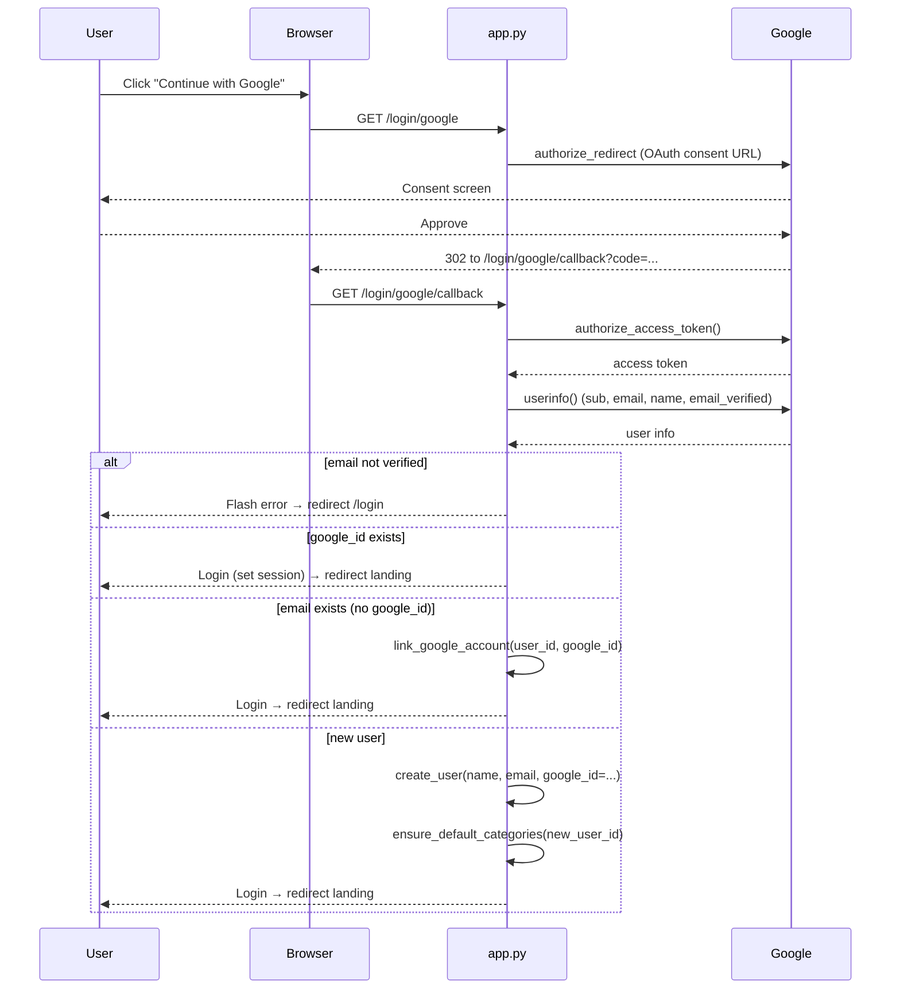
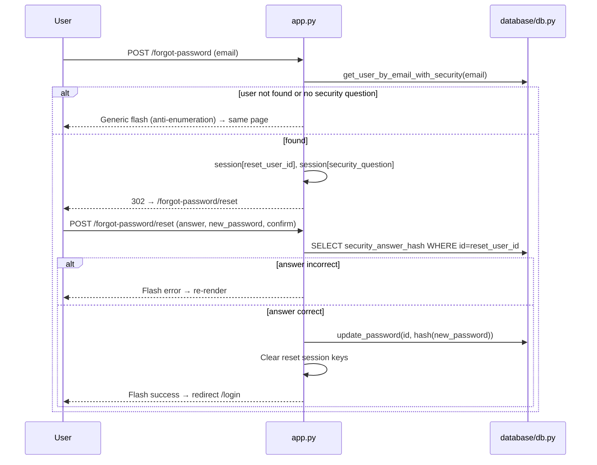

# 💰 Spendly — Project Documentation

> **Track every rupee. Know where it goes.**
>
> This document is a complete, code-derived reference for the Spendly project.
> It is intended for developers who need to understand, run, maintain, and
> extend the application without external guidance. Every statement below
> is verified directly against the current repository source code (including
> Authentication, Dashboard, Expenses, Transactions, Categories, Reports,
> Budgets, Goals, Settings, Help & Support, and Legal modules).

---

## Table of Contents

1. [Project Overview](#1-project-overview)
2. [Features](#2-features)
3. [Technology Stack](#3-technology-stack)
4. [Architecture](#4-architecture)
5. [Folder Structure](#5-folder-structure)
6. [File-by-File Explanations](#6-file-by-file-explanations)
7. [Database Schema](#7-database-schema)
8. [Routes](#8-routes)
9. [Authentication & Authorization](#9-authentication--authorization)
10. [Key Workflows](#10-key-workflows)
11. [Frontend](#11-frontend)
12. [Backend](#12-backend)
13. [Configuration & Environment Variables](#13-configuration--environment-variables)
14. [Installation & Setup](#14-installation--setup)
15. [Dependencies](#15-dependencies)
16. [Security Architecture](#16-security-architecture)
17. [Error Handling](#17-error-handling)
18. [Testing](#18-testing)
19. [Deployment](#19-deployment)
20. [Known Issues & Limitations](#20-known-issues--limitations)
21. [Future Improvements](#21-future-improvements)

---

## 1. Project Overview

**Spendly** is a personal finance and expense tracking web application built with **Flask** and **SQLite**. Users can sign up with an email/password or Google OAuth, record expenses with granular metadata (category, payment method, date, description), manage custom categories with an icon and color palette, inspect a high-performance, filterable, sortable, and paginated Transactions ledger, set and monitor monthly category budgets, establish and fund milestone-driven savings goals, generate analytical reports with interactive charts and dynamic financial insights, customize system-wide preferences and security sessions in Settings, access an interactive Help & Support center with support ticket submission, and view compliant legal policies.

### Key Characteristics
- **Single-file application routing**: All routes, context processors, and session validation live in `app.py`.
- **Raw SQLite persistence**: All database interactions, table definitions, and migrations use standard `sqlite3` in `database/db.py` (no ORM / SQLAlchemy).
- **Vanilla Frontend**: Standard HTML5, vanilla CSS3 with custom variables, and vanilla JavaScript (no npm, no Webpack, no frontend frameworks).
- **Comprehensive test suite**: 7 test suites containing **294 automated tests** with 100% pass rate.

---

## 2. Features

| Module | Features & Capabilities |
|---|---|
| **Authentication** | Email & password registration/login, Google OAuth 2.0 via Authlib, security question password recovery, session tracking with remote device revocation, and `@app.before_request` session validation. |
| **Dashboard (Profile)** | KPI cards (Total Spent, Transaction Count, Top Category), dynamic period filter (All Time, 1 Month, 3 Months, 6 Months, Custom), proportional category spending bars, recent transactions, and profile editor. |
| **Expenses CRUD** | Create, view, edit, and delete expenses with amount, category, date, description, and payment method (`card`, `upi`, `cash`, `bank`, `wallet`). Automatically logs audit trail records in the `activities` table. |
| **Transactions Ledger** | Server-side filtered, sorted, paginated ledger with 5 summary cards (dynamically computed on filtered data), multi-row bulk selection with bulk delete, transaction details modal, Recent Activity timeline, and CSV export (`/transactions/export`). |
| **Categories** | Custom category builder with 22 Lucide icons and 15 hex colors, donut chart distribution, top categories ranking, protected deletion (reassigns in-use expenses to "Other"), category merge, and dedicated analytics (`/categories/analytics`). |
| **Budgets** | Monthly budget caps per category, real-time health badges (**On Track** <80%, **Warning** 80–100%, **Over Budget** >100%), Budget vs Actual comparison charts, 6-month historical trend analysis, budget resets, and CSV export (`/budgets/export`). |
| **Goals** | Savings targets with deadlines and progress tracking (**On Track**, **At Risk**, **Completed**, **Paused**), quick fund allocation buttons (+₹500, +₹1,000, +₹5,000), required daily/monthly savings pacing, and CSV export (`/goals/export`). |
| **Reports & Analytics** | Financial summary indicators (Avg Daily, Highest Day, Savings Rate), Chart.js monthly trends and category/payment donuts, top 10 expenses table, monthly breakdown table, dynamic personalized insights, and printable export. |
| **Settings** | Tabbed preferences: Profile (avatar, bio, phone), Regional & Preferences (currency, date format, language, week start, budget threshold), Security (2FA toggle, active session manager with device revocation, password change), Notifications, Appearance (Light/Dark/System theme, 6 accent colors, Comfortable/Compact density), Data & Privacy (insights toggle, unified CSV backup, clear data, delete account). |
| **Help & Support** | Live knowledge base search (`/` shortcut), topic filter chips, interactive FAQ accordion, system status health monitor, support ticket submission modal storing tickets in `support_tickets`, and direct resource links. |
| **Legal Pages** | Dedicated, styled [Terms & Conditions](/terms) and [Privacy Policy](/privacy) pages. |

---

## 3. Technology Stack

| Layer | Technology | Details |
|---|---|---|
| **Backend Framework** | [Flask](https://flask.palletsprojects.com/) `3.1.3` | Single-file WSGI application in `app.py` |
| **Database** | SQLite 3 | Embedded SQL engine; raw `sqlite3` connections with `PRAGMA foreign_keys = ON` |
| **Template Engine** | Jinja2 | Modular template inheritance extending `base.html` |
| **Frontend** | Vanilla HTML5, CSS3, JavaScript | Modern CSS Custom Properties, flexbox/grid layouts, no npm packages |
| **Icons** | [Lucide Icons](https://lucide.dev/) | CDN release (`unpkg.com/lucide@latest`) |
| **Charts** | [Chart.js](https://www.chartjs.org/) & CSS Conic Gradients | Interactive reports charts and category distribution |
| **Typography** | Google Fonts | DM Serif Display + DM Sans |
| **Authentication** | `werkzeug.security` & [Authlib](https://authlib.org/) | `generate_password_hash`, `check_password_hash`, Google OAuth 2.0 OpenID Connect |
| **Environment Config** | `python-dotenv` | Loads configuration from `.env` |
| **Testing** | [pytest](https://pytest.org/) `8.3.5` & `pytest-flask` `1.3.0` | Temporary SQLite database isolation, 294 passing tests |
| **Production WSGI** | [Gunicorn](https://gunicorn.org/) `23.0.0` | Production WSGI HTTP server |

---

## 4. Architecture

Spendly implements a straightforward **Route Handler → Database Helper → SQLite** architectural model.

```
  HTTP Client / Web Browser
             │
             ▼
 ┌─────────────────────────────────────────────────────────────┐
 │                         app.py                              │
 │  - Route Handlers & URL Dispatching                         │
 │  - @app.before_request (Session Revocation & Auth Guard)    │
 │  - @app.context_processor (User Appearance & Settings)      │
 │  - Form Validation & Flash Messaging                        │
 │  - OAuth 2.0 Client Orchestration                           │
 └─────────────────────────────┬───────────────────────────────┘
                               │ Imports helpers
                               ▼
 ┌─────────────────────────────────────────────────────────────┐
 │                      database/db.py                         │
 │  - Schema initialization (12 tables) & Data Seeding         │
 │  - Parameterized SQLite Queries & Transactions              │
 │  - User, Expense, Transaction, Category, Budget, Goal,      │
 │    Settings, Session, and Support Ticket Data Access Logic  │
 └─────────────────────────────┬───────────────────────────────┘
                               │ Executes raw SQL
                               ▼
 ┌─────────────────────────────────────────────────────────────┐
 │               SQLite Database (expense_tracker.db)          │
 │  users, expenses, activities, categories, budgets, goals,   │
 │  user_sessions, user_settings, support_tickets,             │
 │  ticket_messages, support_articles, support_faqs            │
 └─────────────────────────────────────────────────────────────┘
```

### Module Boundaries in `app.py`

| Module Area | Route Handlers | Primary Database Helpers |
|---|---|---|
| **Auth & Sessions** | `register`, `login`, `google_login`, `google_callback`, `logout` | `create_user`, `get_user_by_email`, `get_user_by_google_id`, `link_google_account`, `db_create_user_session`, `db_get_user_session_by_token` |
| **Password Reset** | `forgot_password`, `reset_password` | `get_user_by_email_with_security`, `update_password`, `db_get_security_answer_hash` |
| **Profile & Dashboard** | `profile`, `profile_edit`, `profile_update`, `profile_change_password` | `get_user_by_id`, `update_user_profile`, `update_password`, `get_user_expenses_summary` |
| **Expenses** | `list_expenses`, `add_expense`, `edit_expense`, `delete_expense_view` | `db_create_expense`, `db_get_expenses_by_user`, `db_get_expense_by_id`, `db_update_expense`, `db_delete_expense`, `db_add_activity` |
| **Transactions** | `transactions`, `transactions_export`, `transactions_bulk_delete` | `db_get_transactions`, `db_get_expenses_by_ids`, `db_delete_expenses_bulk`, `db_get_recent_activity`, `db_add_activity` |
| **Categories** | `categories`, `add_category`, `view_category`, `edit_category`, `delete_category_view`, `merge_categories_view`, `categories_export`, `categories_analytics` | `db_get_user_categories`, `db_create_category`, `db_get_category_by_id`, `db_update_category`, `db_delete_category`, `db_get_categories`, `db_get_category_stats`, `db_get_categories_export`, `db_merge_categories` |
| **Budgets** | `budgets`, `add_budget`, `edit_budget`, `delete_budget_view`, `reset_budgets`, `budgets_export` | `db_get_budget_data`, `db_get_budget_months`, `db_get_user_budgets`, `db_get_budget_by_id`, `db_create_budget`, `db_update_budget_limit`, `db_delete_budget`, `db_reset_budget_defaults` |
| **Goals** | `goals`, `add_goal`, `edit_goal`, `delete_goal_view`, `add_goal_funds_view`, `goals_export` | `db_get_goal_data`, `db_get_user_goals`, `db_get_goal_by_id`, `db_create_goal`, `db_update_goal`, `db_delete_goal`, `db_add_goal_funds` |
| **Reports** | `reports` | `db_get_report_data`, `db_get_user_categories`, `db_get_user_settings` |
| **Settings** | `settings`, `settings_save`, `settings_theme`, `settings_sessions_revoke`, `settings_change_password`, `settings_reset`, `settings_export`, `settings_clear_data`, `settings_delete_account` | `db_get_user_settings`, `db_update_user_settings`, `db_reset_user_settings`, `db_get_user_sessions`, `db_revoke_user_session`, `db_clear_user_data`, `db_delete_user_account` |
| **Help & Support** | `help_view`, `help_create_ticket` | `get_help_articles`, `get_help_faqs`, `db_create_support_ticket`, `db_get_user_tickets` |
| **Legal** | `terms`, `privacy` | Render static legal templates |

---

## 5. Folder Structure

```
spendly/
├── app.py                       # Application controller & route definitions
├── requirements.txt             # Pinned Python package dependencies
├── README.MD                    # High-level overview, quickstart & feature list
├── PROJECT_DOCUMENTATION.md     # Code-level developer reference (this document)
├── CLAUDE.md                    # Coding standards & maintenance instructions
├── .env                         # Environment variables (gitignored)
├── database/
│   ├── __init__.py              # Python package marker
│   └── db.py                    # Schema definition, migrations, seed, and data queries
├── templates/
│   ├── base.html                # App shell layout (sidebar, header, footer, scripts)
│   ├── landing.html             # Public landing page with video modal & feature highlights
│   ├── login.html               # Sign-in form (Email/Password & Google OAuth)
│   ├── register.html            # Registration form with security question picker
│   ├── forgot_password.html     # Password recovery Step 1: Email verification
│   ├── reset_password.html      # Password recovery Step 2: Answer question & reset
│   ├── profile.html             # Dashboard with metrics, category bars, and recent txns
│   ├── profile_edit.html        # Profile details editor and password changer
│   ├── transactions.html        # Transactions ledger, filter bar, bulk selection, view modal
│   ├── budgets.html             # Budgets dashboard, category limit cards, trend charts
│   ├── goals.html               # Savings goals dashboard, add funds modal, pacing stats
│   ├── reports.html             # Financial reports with Chart.js, insights, and data tables
│   ├── settings.html            # User settings center (Preferences, Security, Appearance, Data)
│   ├── help.html                # Searchable knowledge base, FAQs, system status, ticket modal
│   ├── privacy.html             # Privacy Policy
│   ├── terms.html               # Terms & Conditions
│   ├── expenses/
│   │   ├── list.html            # Simple expense ledger list
│   │   ├── form.html            # Add / Edit expense form (with payment method picker)
│   │   └── delete.html          # Expense deletion confirmation
│   └── categories/
│       ├── list.html            # Categories dashboard (summary cards, table, donut chart)
│       ├── form.html            # Category builder (Lucide icon & color palette pickers)
│       ├── view.html            # Single category overview and statistics
│       ├── delete.html          # Protected category deletion confirmation
│       ├── merge.html           # Category merge tool
│       └── analytics.html       # Category analytics and distribution breakdown
├── static/
│   ├── css/
│   │   ├── style.css            # Global design tokens, app shell, themes, typography
│   │   ├── landing.css          # Landing page styles
│   │   ├── profile.css          # Dashboard and profile editor styles
│   │   ├── expenses.css         # Expense CRUD and category tag styles
│   │   ├── transactions.css     # Transactions ledger, filters, table, and modal styles
│   │   ├── categories.css       # Categories dashboard, forms, donut, and analytics styles
│   │   ├── budgets.css          # Budgets progress cards, charts, and modal styles
│   │   ├── goals.css            # Goals progress bars, milestone badges, and modal styles
│   │   ├── reports.css          # Reports charts, tables, and insight card styles
│   │   ├── settings.css         # Settings tab navigation, toggles, and form styles
│   │   ├── help.css             # Help center, search chips, FAQ accordions, ticket modal
│   │   └── controls.css         # Reusable form controls, buttons, and UI components
│   └── js/
│       ├── main.js              # Sidebar toggle, drawer navigation, theme switch
│       ├── transactions.js      # Ledger filtering, bulk selection, view modal
│       ├── categories.js        # Category icon/color pickers, live filter, delete guard
│       ├── budgets.js           # Budgets limit editor, chart render, modal management
│       ├── goals.js             # Goals fund allocation calculator, filter interactions
│       ├── reports.js           # Reports Chart.js rendering, filter handling, PDF export
│       ├── settings.js          # Settings tab routing, session revocation, theme preview
│       └── help.js              # Help live search, FAQ toggle, ticket submission AJAX/modal
└── tests/
    ├── __init__.py              # Python package marker
    ├── conftest.py              # Pytest fixtures and isolated temporary database engine
    ├── test_backend_connection.py  # Database connection, user lookup, profile tests (17 tests)
    ├── test_transactions.py        # Transactions filters, sorting, pagination, bulk delete (42 tests)
    ├── test_categories.py          # Category CRUD, stats, merge, protected deletion (45 tests)
    ├── test_budgets.py             # Budgets CRUD, limits, calculations, trend charts (41 tests)
    ├── test_goals.py               # Goals CRUD, status engine, funds addition, deadlines (47 tests)
    ├── test_settings.py            # Settings persistence, sessions, appearance, data clear (59 tests)
    └── test_help.py                # Help center, article/FAQ queries, ticket submission (43 tests)
```

---

## 6. File-by-File Explanations

### 6.1 `app.py`
The primary Flask application controller.
- **Application Setup**: Initializes Flask app, loads `.env`, registers Google OAuth client, runs initial database setup (`init_db()`, `seed_db()`, `db_backfill_categories()`, `db_seed_help_content()`).
- **Session Middleware (`guard_revoked_session`)**: Runs `@app.before_request` to check the current signed session token against `user_sessions`. If the token is revoked or invalidated, clears the session and redirects to `/login`.
- **Global Context Processor (`inject_app_context`)**: Injects user appearance settings (`theme`, `accent_color`, `interface_density`, `currency`, `date_format`), category constants, and navigation metadata into all Jinja templates.
- **Route Handlers**: Implements all 42 HTTP endpoints across Auth, Profile, Expenses, Transactions, Categories, Budgets, Goals, Reports, Settings, Help, and Legal pages.

### 6.2 `database/db.py`
The complete database abstraction layer.
- **`get_db()`**: Factory returning an active SQLite connection with row factories enabled and foreign keys enforced.
- **`init_db()`**: Idempotent table creation for all 12 tables and conditional column migrations (`ALTER TABLE`).
- **`seed_db()`**: Seeds default demo user (`demo@spendly.com`), 8 sample expenses across categories with payment methods, matching activities, and default categories.
- **`seed_help_content()`**: Seeds initial help articles and FAQ records for the knowledge base.
- **Data Access Functions**: Clean parameterized functions for every database entity.

---

## 7. Database Schema

The database consists of **12 structured tables**:

### 1. `users`
```sql
CREATE TABLE users (
    id INTEGER PRIMARY KEY AUTOINCREMENT,
    name TEXT NOT NULL,
    email TEXT UNIQUE NOT NULL,
    password_hash TEXT NOT NULL,
    created_at TEXT DEFAULT (datetime('now')),
    google_id TEXT,
    security_question TEXT,
    security_answer_hash TEXT,
    phone TEXT DEFAULT '',
    bio TEXT DEFAULT ''
);
```

### 2. `expenses`
```sql
CREATE TABLE expenses (
    id INTEGER PRIMARY KEY AUTOINCREMENT,
    user_id INTEGER NOT NULL REFERENCES users(id),
    amount REAL NOT NULL,
    category TEXT NOT NULL,
    date TEXT NOT NULL,
    description TEXT,
    payment_method TEXT NOT NULL DEFAULT 'cash',
    created_at TEXT DEFAULT (datetime('now'))
);
```

### 3. `activities`
```sql
CREATE TABLE activities (
    id INTEGER PRIMARY KEY AUTOINCREMENT,
    user_id INTEGER NOT NULL REFERENCES users(id),
    action TEXT NOT NULL,  -- 'added', 'edited', 'deleted'
    expense_id INTEGER,
    category TEXT,
    description TEXT,
    amount REAL,
    created_at TEXT DEFAULT (datetime('now'))
);
```

### 4. `categories`
```sql
CREATE TABLE categories (
    id INTEGER PRIMARY KEY AUTOINCREMENT,
    user_id INTEGER NOT NULL REFERENCES users(id),
    name TEXT NOT NULL,
    description TEXT DEFAULT '',
    icon TEXT NOT NULL DEFAULT 'tag',
    color TEXT NOT NULL DEFAULT '#1a472a',
    created_at TEXT DEFAULT (datetime('now')),
    UNIQUE (user_id, name)
);
```

### 5. `budgets`
```sql
CREATE TABLE budgets (
    id INTEGER PRIMARY KEY AUTOINCREMENT,
    user_id INTEGER NOT NULL REFERENCES users(id),
    category TEXT NOT NULL,
    limit_amount REAL NOT NULL,
    period TEXT NOT NULL DEFAULT 'monthly',
    is_default INTEGER NOT NULL DEFAULT 0,
    created_at TEXT DEFAULT (datetime('now')),
    UNIQUE (user_id, category)
);
```

### 6. `goals`
```sql
CREATE TABLE goals (
    id INTEGER PRIMARY KEY AUTOINCREMENT,
    user_id INTEGER NOT NULL REFERENCES users(id),
    name TEXT NOT NULL,
    category TEXT NOT NULL,
    target_amount REAL NOT NULL,
    saved_amount REAL NOT NULL DEFAULT 0,
    deadline TEXT NOT NULL,
    status TEXT NOT NULL DEFAULT 'on-track',  -- 'on-track', 'at-risk', 'completed', 'paused'
    created_at TEXT DEFAULT (datetime('now')),
    updated_at TEXT DEFAULT (datetime('now'))
);
```

### 7. `user_sessions`
```sql
CREATE TABLE user_sessions (
    id INTEGER PRIMARY KEY AUTOINCREMENT,
    user_id INTEGER NOT NULL REFERENCES users(id),
    token TEXT UNIQUE NOT NULL,
    ip_address TEXT DEFAULT '',
    user_agent TEXT DEFAULT '',
    created_at TEXT DEFAULT (datetime('now')),
    last_seen TEXT DEFAULT (datetime('now')),
    revoked INTEGER NOT NULL DEFAULT 0
);
```

### 8. `user_settings`
```sql
CREATE TABLE user_settings (
    id INTEGER PRIMARY KEY AUTOINCREMENT,
    user_id INTEGER NOT NULL REFERENCES users(id),
    currency TEXT NOT NULL DEFAULT 'INR',
    date_format TEXT NOT NULL DEFAULT 'DD-MM-YYYY',
    language TEXT NOT NULL DEFAULT 'en',
    week_start TEXT NOT NULL DEFAULT 'monday',
    budget_alert_threshold INTEGER NOT NULL DEFAULT 80,
    default_payment_method TEXT NOT NULL DEFAULT 'upi',
    theme TEXT NOT NULL DEFAULT 'dark',
    accent_color TEXT NOT NULL DEFAULT 'green',
    interface_density TEXT NOT NULL DEFAULT 'comfortable',
    two_factor_enabled INTEGER NOT NULL DEFAULT 0,
    login_alerts_enabled INTEGER NOT NULL DEFAULT 1,
    expense_reminders_enabled INTEGER NOT NULL DEFAULT 1,
    budget_alerts_enabled INTEGER NOT NULL DEFAULT 1,
    goal_milestones_enabled INTEGER NOT NULL DEFAULT 1,
    weekly_summary_enabled INTEGER NOT NULL DEFAULT 1,
    product_updates_enabled INTEGER NOT NULL DEFAULT 0,
    personalised_insights_enabled INTEGER NOT NULL DEFAULT 1,
    anonymous_usage_enabled INTEGER NOT NULL DEFAULT 0,
    created_at TEXT DEFAULT (datetime('now')),
    updated_at TEXT DEFAULT (datetime('now')),
    UNIQUE (user_id)
);
```

### 9. `support_tickets`
```sql
CREATE TABLE support_tickets (
    id INTEGER PRIMARY KEY AUTOINCREMENT,
    user_id INTEGER NOT NULL REFERENCES users(id),
    ticket_no TEXT UNIQUE NOT NULL,
    subject TEXT NOT NULL,
    category TEXT NOT NULL,
    priority TEXT NOT NULL DEFAULT 'normal',  -- 'low', 'normal', 'high', 'urgent'
    message TEXT NOT NULL,
    status TEXT NOT NULL DEFAULT 'open',     -- 'open', 'in_progress', 'resolved', 'closed'
    created_at TEXT DEFAULT (datetime('now')),
    updated_at TEXT DEFAULT (datetime('now'))
);
```

### 10. `ticket_messages`
```sql
CREATE TABLE ticket_messages (
    id INTEGER PRIMARY KEY AUTOINCREMENT,
    ticket_id INTEGER NOT NULL REFERENCES support_tickets(id),
    user_id INTEGER NOT NULL REFERENCES users(id),
    author TEXT NOT NULL,
    body TEXT NOT NULL,
    is_staff INTEGER NOT NULL DEFAULT 0,
    created_at TEXT DEFAULT (datetime('now'))
);
```

### 11. `support_articles`
```sql
CREATE TABLE support_articles (
    id INTEGER PRIMARY KEY AUTOINCREMENT,
    topic TEXT NOT NULL,
    title TEXT NOT NULL,
    excerpt TEXT NOT NULL,
    body TEXT NOT NULL,
    is_public INTEGER NOT NULL DEFAULT 1,
    article_order INTEGER NOT NULL DEFAULT 0,
    created_at TEXT DEFAULT (datetime('now'))
);
```

### 12. `support_faqs`
```sql
CREATE TABLE support_faqs (
    id INTEGER PRIMARY KEY AUTOINCREMENT,
    topic TEXT NOT NULL,
    question TEXT NOT NULL,
    answer TEXT NOT NULL,
    faq_order INTEGER NOT NULL DEFAULT 0,
    created_at TEXT DEFAULT (datetime('now'))
);
```

---

## 8. Routes

### 8.1 Public & Authentication
| Route | Methods | Function | Description |
|---|---|---|---|
| `/` | GET | `landing` | Public landing page with product overview. |
| `/register` | GET, POST | `register` | Registration form with mandatory security question. |
| `/login` | GET, POST | `login` | Email/password sign-in; creates session token in `user_sessions`. |
| `/login/google` | GET | `google_login` | Redirects user to Google OAuth consent screen. |
| `/login/google/callback` | GET | `google_callback` | Handles OAuth token exchange, account creation/linking. |
| `/logout` | GET | `logout` | Revokes active session token and clears session cookie. |

### 8.2 Password Recovery
| Route | Methods | Function | Description |
|---|---|---|---|
| `/forgot-password` | GET, POST | `forgot_password` | Step 1: Submit email to locate account (anti-enumeration protected). |
| `/forgot-password/reset` | GET, POST | `reset_password` | Step 2: Answer security question and provide new password. |

### 8.3 Dashboard & Profile
| Route | Methods | Function | Description |
|---|---|---|---|
| `/profile` | GET | `profile` | Dashboard with financial summary, date filters, recent txns. |
| `/profile/edit` | GET, POST | `profile_edit` | Edit display name, email, and update password. |
| `/profile/update` | POST | `profile_update` | Update name and email endpoint. |
| `/profile/change-password` | POST | `profile_change_password` | Change password requiring current password validation. |

### 8.4 Expenses CRUD
| Route | Methods | Function | Description |
|---|---|---|---|
| `/expenses` | GET | `list_expenses` | Simple expense table view sorted newest-first. |
| `/expenses/add` | GET, POST | `add_expense` | Create a new expense with payment method. |
| `/expenses/<int:id>/edit` | GET, POST | `edit_expense` | Edit expense amount, category, date, description, payment method. |
| `/expenses/<int:id>/delete` | GET, POST | `delete_expense_view` | Confirm and execute expense deletion (logs activity). |

### 8.5 Transactions Ledger
| Route | Methods | Function | Description |
|---|---|---|---|
| `/transactions` | GET | `transactions` | Filterable, sortable, paginated ledger with summary cards. |
| `/transactions/export` | GET | `transactions_export` | Download filtered or selected transactions as CSV. |
| `/transactions/bulk-delete` | POST | `transactions_bulk_delete` | Bulk delete selected transactions with ownership check. |

### 8.6 Categories
| Route | Methods | Function | Description |
|---|---|---|---|
| `/categories` | GET | `categories` | Categories dashboard with summary cards, table, donut chart. |
| `/categories/add` | GET, POST | `add_category` | Create custom category with Lucide icon and hex color. |
| `/categories/<int:category_id>` | GET | `view_category` | View single category statistics and transaction history. |
| `/categories/<int:category_id>/edit` | GET, POST | `edit_category` | Edit category name/icon/color; cascades to expenses on rename. |
| `/categories/<int:category_id>/delete` | GET, POST | `delete_category_view` | Protected deletion (reassigns in-use expenses to "Other"). |
| `/categories/merge` | GET, POST | `merge_categories_view` | Reassign expenses from source to target category and remove source. |
| `/categories/export` | GET | `categories_export` | Export categories with usage statistics to CSV. |
| `/categories/analytics` | GET | `categories_analytics` | Dedicated category spending distribution and analytics view. |

### 8.7 Budgets
| Route | Methods | Function | Description |
|---|---|---|---|
| `/budgets` | GET | `budgets` | Budgets dashboard with category limits, trend charts, insights. |
| `/budgets/add` | POST | `add_budget` | Set or update a monthly category budget limit. |
| `/budgets/<int:budget_id>/edit` | POST | `edit_budget` | Update existing budget limit. |
| `/budgets/<int:budget_id>/delete` | POST | `delete_budget_view` | Remove custom budget override. |
| `/budgets/reset` | POST | `reset_budgets` | Reset all category budgets to default values. |
| `/budgets/export` | GET | `budgets_export` | Export budget limits and performance to CSV. |

### 8.8 Goals
| Route | Methods | Function | Description |
|---|---|---|---|
| `/goals` | GET | `goals` | Savings goals dashboard, progress meters, pacing stats. |
| `/goals/add` | POST | `add_goal` | Create a new savings target with deadline. |
| `/goals/<int:goal_id>/edit` | POST | `edit_goal` | Update savings goal metadata. |
| `/goals/<int:goal_id>/delete` | POST | `delete_goal_view` | Delete a savings goal. |
| `/goals/<int:goal_id>/funds` | POST | `add_goal_funds_view` | Add savings funds to a goal (updates status on completion). |
| `/goals/export` | GET | `goals_export` | Export savings goals to CSV. |

### 8.9 Reports & Analytics
| Route | Methods | Function | Description |
|---|---|---|---|
| `/reports` | GET | `reports` | Comprehensive reporting engine with Chart.js, tables, insights. |

### 8.10 Settings
| Route | Methods | Function | Description |
|---|---|---|---|
| `/settings` | GET | `settings` | Settings center (Preferences, Security, Sessions, Appearance, Data). |
| `/settings/save` | POST | `settings_save` | Save profile, preferences, and notification toggles. |
| `/settings/theme` | POST | `settings_theme` | Update theme and accent color preference. |
| `/settings/sessions/revoke` | POST | `settings_sessions_revoke` | Remotely revoke a specific active device session. |
| `/settings/change-password` | POST | `settings_change_password` | Update account password with current-password verification. |
| `/settings/reset` | POST | `settings_reset` | Reset user settings to defaults. |
| `/settings/export` | GET | `settings_export` | Download full financial data backup as unified CSV. |
| `/settings/clear-data` | POST | `settings_clear_data` | Clear all ledger records while retaining account. |
| `/settings/delete-account` | POST | `settings_delete_account` | Permanently wipe account and all associated database records. |

### 8.11 Help & Support
| Route | Methods | Function | Description |
|---|---|---|---|
| `/help` | GET | `help_view` | Knowledge base search, FAQ accordion, system status. |
| `/help/tickets` | POST | `help_create_ticket` | Submit a new support ticket to `support_tickets`. |

### 8.12 Legal
| Route | Methods | Function | Description |
|---|---|---|---|
| `/terms` | GET | `terms` | Renders Terms & Conditions. |
| `/privacy` | GET | `privacy` | Renders Privacy Policy. |

---

## 9. Authentication & Authorization

### 9.1 Model
- **Session-based authentication** using Flask's signed cookie session.
- On successful login/registration-via-Google, the server stores `session["user_id"]` and `session["user_name"]`.
- **Authorization** is checked per route via the `login_required()` helper (defined in `app.py`):

```python
def login_required():
    if not session.get("user_id"):
        flash("Please sign in to access this page.", "error")
        return redirect(url_for("login"))
    return None
```

Every protected route calls `redirect_resp = login_required()` and returns `redirect_resp` if it is not `None`.

### 9.2 Ownership scoping
- **Expenses**: edit/delete use `WHERE id = ? AND user_id = ?`; route-level `abort(403)` when `expense["user_id"] != session["user_id"]`.
- **Transactions**: all queries are scoped by `user_id`; bulk ops verify each id belongs to the user.
- **Categories**: `get_category_by_id(category_id, user_id)`, `update_category(category_id, user_id, ...)`, `delete_category(category_id, user_id, ...)` all enforce ownership; routes `abort(404)` for missing/foreign resources.
- **Reports**: all queries are scoped by `user_id`.
- **Budgets**: all queries are scoped by `user_id`; CRUD routes verify ownership via `abort(404)`.
- **Goals**: all queries are scoped by `user_id`; CRUD routes verify ownership via `abort(404)`.
- **Settings**: all operations are scoped by `user_id`; `delete_user_account` removes only the current user's data.

### 9.3 Google OAuth flow (Mermaid)



### 9.4 Password reset flow (Mermaid)



### 9.5 Session keys reference

| Key | Set by | Cleared by | Purpose |
|---|---|---|---|
| `user_id` | login, Google callback | logout / `session.clear()` | Authenticated user's primary key |
| `user_name` | login, Google callback, profile update/edit | logout | Display name for navbar/sidebar chip |
| `reset_user_id` | forgot-password | reset_password, logout | Identity for the reset step |
| `security_question` | forgot-password | reset_password, logout | Question shown on reset step |

---

## 10. Key Workflows

### 10.1 Support Ticket Submission
1. User clicks "Contact Support" on `/help` to open modal.
2. User submits subject, topic category, priority, and message.
3. Server validates fields, creates an auto-generated ticket number (`SP-XXXXX`), and records the ticket in `support_tickets`.
4. User receives confirmation and ticket status.

### 10.2 Active Session Management & Revocation
1. On login, `_record_login_session(user_id)` stores a token in `user_sessions` with IP and User-Agent.
2. User navigates to **Settings → Security → Active Sessions** to view all logged-in devices.
3. User clicks "Revoke" on another session → server sets `revoked = 1` in `user_sessions`.
4. On the revoked device's next HTTP request, `@app.before_request` detects the revocation, terminates the session, and redirects to `/login`.

---

## 11. Frontend Architecture

- **Theme Engine**: Light / Dark / System theme switcher persisted in `localStorage` (`spendly-theme`) and synchronized with the database user settings.
- **Component Controls**: Centralized in `static/css/controls.css` and `static/css/style.css`.
- **Iconography**: Dynamic SVG rendering via Lucide Icons.

---

## 12. Backend Architecture

- **Context Processor**: Injects theme, accent color, density, and formatting settings across all templates.
- **Data Protection**: Parameterized SQL queries on 100% of queries.
- **Graceful Error Recovery**: Flash messaging categorized into `success` and `error` with custom form styling.

---

## 13. Configuration & Environment Variables

| Variable | Usage | Default | Required? |
|---|---|---|---|
| `SECRET_KEY` | Flask session cookie cryptographic signing | `"spendly-dev-secret-key"` | No (override in production) |
| `GOOGLE_CLIENT_ID` | Google OAuth 2.0 Client ID | `""` | For Google login |
| `GOOGLE_CLIENT_SECRET` | Google OAuth 2.0 Client Secret | `""` | For Google login |
| `PORT` | WSGI listening port | `5001` | No |

---

## 14. Installation & Setup

```bash
# 1. Clone repository
git clone https://github.com/sonusuman147/spendly.git
cd spendly

# 2. Virtual environment setup
python -m venv venv
venv\Scripts\activate          # Windows
# source venv/bin/activate     # macOS / Linux

# 3. Dependency installation
pip install -r requirements.txt

# 4. Start local development server
python app.py
```

Access at **http://127.0.0.1:5001**.

---

## 15. Dependencies

- `flask==3.1.3`
- `werkzeug==3.1.6`
- `pytest==8.3.5`
- `pytest-flask==1.3.0`
- `authlib>=1.3.0`
- `requests>=2.28.0`
- `python-dotenv>=1.0.0`
- `gunicorn==23.0.0`

---

## 16. Security Architecture

- **Password Cryptography**: Passwords hashed using Werkzeug (`scrypt`/`pbkdf2`).
- **SQL Injection Immunization**: Parameterized queries across all database operations.
- **Foreign Key Constraint Enforcement**: `PRAGMA foreign_keys = ON` on all database connections.
- **Remote Session Invalidation**: Instant revocation of device tokens.
- **IDOR Protections**: Explicit `user_id` validation in every update and deletion query.

---

## 17. Error Handling

- **Validation Errors**: Flashed using `flash(message, "error")` with submitted inputs preserved.
- **Unique Constraint Violations**: Caught via `sqlite3.IntegrityError` and translated into clear user feedback.
- **HTTP 404 / 403 Responses**: Triggered via `abort()` when resources are missing or owned by other users.

---

## 18. Testing

Execute the complete test suite:

```bash
# Run all 294 automated tests
pytest

# Run tests with detailed verbose output
pytest -v
```

### Test Inventory (294 Tests)
1. `tests/test_backend_connection.py` (**17 tests**) — User lookup, database helpers, profile routes.
2. `tests/test_transactions.py` (**42 tests**) — Transactions filtering, sorting, pagination, bulk deletion, CSV export.
3. `tests/test_categories.py` (**45 tests**) — Category CRUD, usage stats, protected deletion, merge, analytics.
4. `tests/test_budgets.py` (**41 tests**) — Budget calculations, limits, monthly trends, resets, export.
5. `tests/test_goals.py` (**47 tests**) — Goals status engine, add funds calculator, deadlines, export.
6. `tests/test_settings.py` (**59 tests**) — Settings persistence, appearance, active sessions & revocation, data clear, deletion.
7. `tests/test_help.py` (**43 tests**) — Help center rendering, topic filters, FAQs, support ticket submission & isolation.

---

## 19. Deployment

The project ships with **Gunicorn** in `requirements.txt` and binds to `0.0.0.0` when run directly.

### Local / dev
```bash
python app.py        # serves on 0.0.0.0:5001 (or $PORT)
```

### Production (Gunicorn)
```bash
gunicorn -w 4 -b 0.0.0.0:8000 app:app
```

Recommended deployment behind an Nginx reverse proxy with SSL/TLS termination.

---

## 20. Known Issues & Limitations

1. **CSRF Protection**: Native Flask session cookies used; recommend `Flask-WTF` for public production deployments.
2. **SQLite Concurrency**: SQLite is single-writer; optimal for single-node deployments.
3. **Google-Only Accounts**: Google OAuth users have empty password hashes and do not use security question resets.

---

## 21. Future Improvements

1. **Blueprint Architecture**: Modularize `app.py` into dedicated Flask Blueprints.
2. **Database ORM**: Optional migration to SQLAlchemy/PostgreSQL for multi-instance horizontal scaling.
3. **Email Notification Engine**: Add SMTP email integration for automated budget alerts and weekly digests.

---

*Documentation verified against current Spendly source code.*