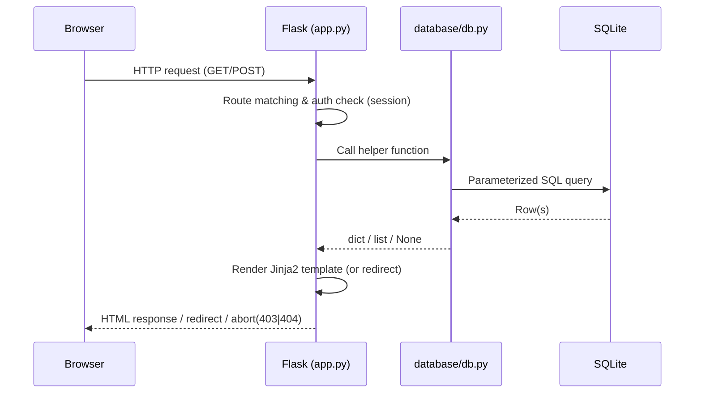
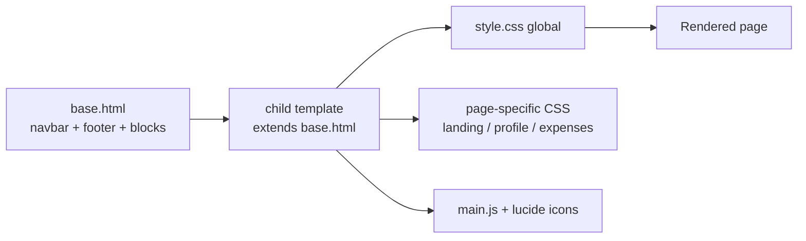
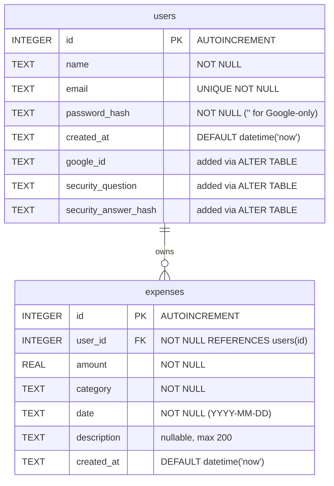
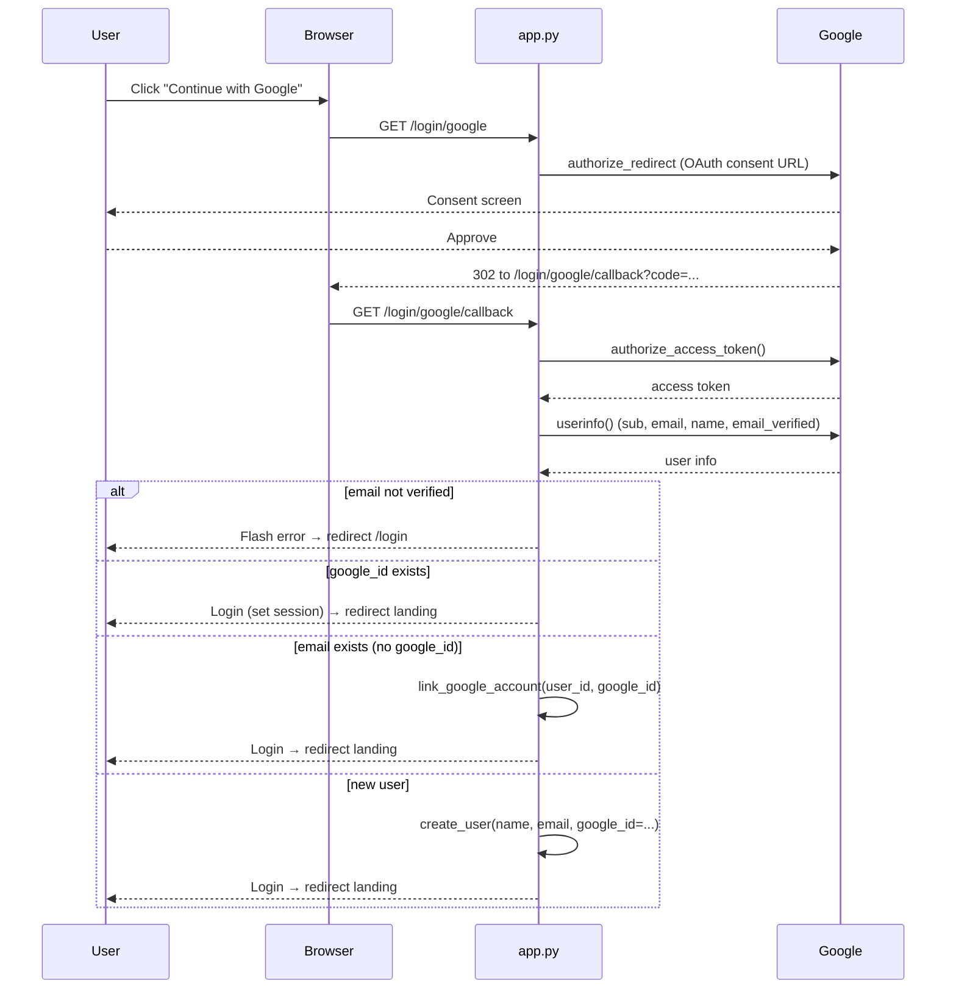
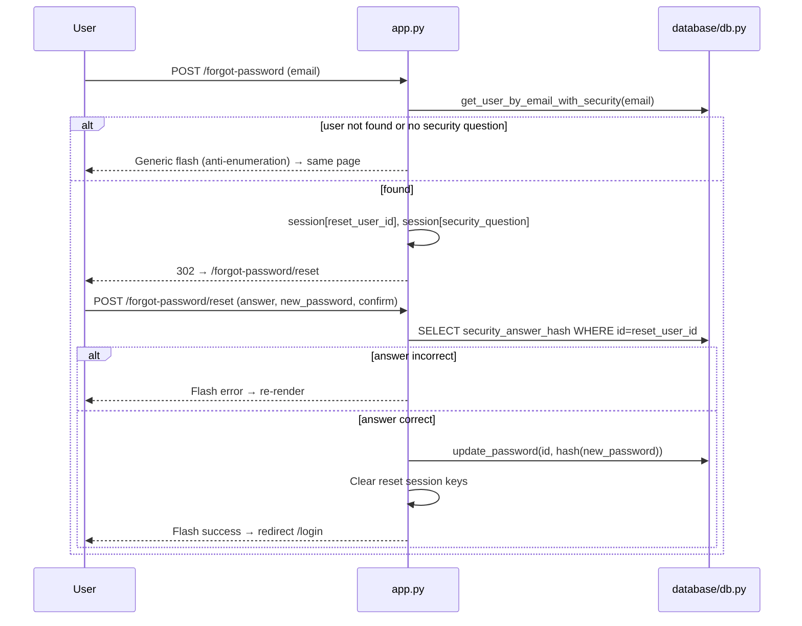

# 💰 Spendly — Project Documentation

> **Track every rupee. Know where it goes.**
>
> This document is a complete, code-derived reference for the Spendly project.
> It is intended for new developers who need to understand, run, maintain, and
> extend the application without any external guidance. Every statement below
> is based on the actual source code in this repository.

---

## Table of Contents

1. [Project Overview](#1-project-overview)
2. [Features](#2-features)
3. [Technology Stack](#3-technology-stack)
4. [Architecture](#4-architecture)
5. [Folder Structure](#5-folder-structure)
6. [File-by-File Explanations](#6-file-by-file-explanations)
7. [Database Schema](#7-database-schema)
8. [Routes](#8-routes)
9. [Authentication & Authorization](#9-authentication--authorization)
10. [Key Workflows](#10-key-workflows)
11. [Frontend](#11-frontend)
12. [Backend](#12-backend)
13. [Configuration & Environment Variables](#13-configuration--environment-variables)
14. [Installation & Setup](#14-installation--setup)
15. [Dependencies](#15-dependencies)
16. [Security](#16-security)
17. [Error Handling](#17-error-handling)
18. [Testing](#18-testing)
19. [Deployment](#19-deployment)
20. [Known Issues & Limitations](#20-known-issues--limitations)
21. [Future Improvements](#21-future-improvements)

---

## 1. Project Overview

**Spendly** is a lightweight personal expense tracker built with **Flask** and
**SQLite**. Users can sign up with an email/password or "Continue with Google",
log expenses with amount/category/description/date, and view spending insights
such as total spent, transaction count, top category, and category breakdowns —
filterable by time period.

The project deliberately avoids heavy abstractions:

- A single `app.py` file contains **all** routes (no Flask blueprints).
- Raw `sqlite3` is used for persistence (no ORM / SQLAlchemy).
- Vanilla HTML/CSS/JavaScript is used for the frontend (no React, no npm, no build step).
- The whole application runs from a single Python process.

### Author context
The codebase contains README and CLAUDE.md files indicating the project was built
for a learning/portfolio context ("students will add JavaScript here" in
`main.js`), but it is a fully functional application.

---

## 2. Features

| Feature | Description |
|---|---|
| **Email/password sign-up** | Registration with name, email, password, and a mandatory security question/answer. |
| **Email/password sign-in** | Session-based login with generic error messages (no account enumeration). |
| **Google OAuth sign-in** | "Continue with Google" via Authlib. Auto-creates a new account or auto-links to an existing account by matching email. |
| **Password recovery** | Two-step flow: enter email → answer security question → set a new password. No email server required. |
| **Expense CRUD** | Add, view, edit, and delete expenses with amount, category, description, and date. |
| **Expense list** | All expenses for a user, sorted newest-first, with per-category color tags. |
| **Dashboard / Profile page** | Shows total spent (₹), transaction count, top category, recent 5 transactions, and a category breakdown with proportional bars. |
| **Date filtering** | Quick filters — All Time, This Month, Last 3 Months, Last 6 Months — plus a custom Start/End date range. |
| **Profile editing** | Edit name/email and optionally change the password (current password required). |
| **Theme switching** | Light / Dark / System theme persisted in `localStorage` (`spendly-theme`). |
| **Legal pages** | Terms & Conditions and Privacy Policy pages. |
| **Seed data** | A demo user (`demo@spendly.com` / `demo123`) with 8 sample expenses is inserted automatically on first run. |

---

## 3. Technology Stack

| Layer | Technology | Version / Notes |
|---|---|---|
| Backend framework | [Flask](https://flask.palletsprojects.com/) | `3.1.3` — single `app.py`, no blueprints |
| Database | SQLite (raw `sqlite3`) | File `expense_tracker.db` in project root; no ORM |
| Template engine | Jinja2 | Bundled with Flask |
| Frontend | Vanilla HTML / CSS / JS | No frameworks, no npm, no build step |
| Icons | [Lucide](https://lucide.dev/) | Loaded from CDN (`unpkg.com/lucide@latest`) |
| Fonts | Google Fonts | DM Serif Display + DM Sans |
| Password hashing | `werkzeug.security` | `generate_password_hash` / `check_password_hash` |
| OAuth | [Authlib](https://authlib.org/) | `authlib>=1.3.0`, Flask integration |
| Config loading | [python-dotenv](https://pypi.org/project/python-dotenv/) | `>=1.0.0` |
| HTTP client (OAuth) | `requests` | `>=2.28.0` (Authlib dependency) |
| Testing | [pytest](https://pytest.org/) + [pytest-flask](https://pypi.org/project/pytest-flask/) | `8.3.5` / `1.3.0` |
| Production WSGI | [Gunicorn](https://gunicorn.org/) | `23.0.0` |
| Language | Python | `3.10+` assumed (f-strings used) |

---

## 4. Architecture

Spendly follows a simple **route → helper → SQLite** layering:

```
 Browser / HTTP client
        │
        ▼
┌──────────────────────┐
│    app.py (Flask)    │  All routes, sessions, form validation, flash
│  ┌────────────────┐  │  messages, OAuth orchestration
│  │ Route handlers │  │
│  └───────┬────────┘  │
└──────────┼───────────┘
           │  imports database helpers
           ▼
┌──────────────────────┐
│  database/db.py      │  All SQL: schema, seed, CRUD, summary queries
│  (raw sqlite3)       │
└──────────┬───────────┘
           │  DATABASE_PATH = "expense_tracker.db"
           ▼
┌──────────────────────┐
│  SQLite database     │  Tables: users, expenses
└──────────────────────┘
```

### Request lifecycle (Mermaid)



### Template rendering flow



---

## 5. Folder Structure

```
spendly/
├── app.py                       # All routes — single file, no blueprints
├── requirements.txt             # Pinned dependencies
├── README.MD                    # Project readme (features, setup, routes)
├── CLAUDE.md                    # Agent/maintenance notes & conventions
├── implementation_plan.md       # Historical implementation plan for Step 06
├── TODO.md                      # Task tracking (theme label removal)
├── PROJECT_DOCUMENTATION.md     # This document
├── .gitignore                   # Ignores venv/, *.db, __pycache__, .env, etc.
├── expense_tracker.db           # SQLite database (created at runtime, gitignored)
├── database/
│   ├── __init__.py              # Empty package marker
│   └── db.py                    # All DB logic: schema, seed, queries, helpers
├── templates/
│   ├── base.html                # Shared layout — every template extends this
│   ├── landing.html             # Public landing page (hero, features, modal)
│   ├── login.html               # Sign-in (email + Google OAuth button)
│   ├── register.html            # Registration with security question
│   ├── forgot_password.html     # Step 1: enter email
│   ├── reset_password.html      # Step 2: security answer + new password
│   ├── profile.html             # Dashboard: stats, filter bar, recent txns, categories
│   ├── profile_edit.html        # Edit profile (name/email) + change password
│   ├── privacy.html             # Privacy policy
│   ├── terms.html               # Terms & conditions
│   └── expenses/
│       ├── list.html            # Expense list table
│       ├── form.html            # Add / Edit expense form (mode-dependent)
│       └── delete.html          # Delete confirmation page
├── static/
│   ├── css/
│   │   ├── style.css            # Global styles, CSS variables, navbar/footer, auth, themes
│   │   ├── landing.css          # Landing hero, dashboard mockup, modal, features/CTA
│   │   ├── profile.css          # Profile dashboard, filter bar, stats, category bars, edit page
│   │   └── expenses.css         # Expense table, form, delete confirmation, tags
│   └── js/
│       └── main.js              # Vanilla JS hook — currently contains only a comment
└── tests/
    ├── __init__.py              # Test package marker
    ├── conftest.py              # Pytest fixtures (app, client, db) + temp-DB isolation
    └── test_backend_connection.py  # 16 tests: DB helpers + /profile route behavior
```

> The `.env` file is referenced in docs and `.gitignore` but is **not committed**
> (contains `GOOGLE_CLIENT_ID` / `GOOGLE_CLIENT_SECRET`).

---

## 6. File-by-File Explanations

### 6.1 `app.py` (root)
The entire Flask application.

- **App factory / creation**: `app = Flask(__name__)`; `SECRET_KEY` read from `SECRET_KEY` env var, defaulting to `"spendly-dev-secret-key"`.
- **OAuth setup**: Registers the `google` OAuth client using `GOOGLE_CLIENT_ID` / `GOOGLE_CLIENT_SECRET`, OpenID metadata URL, and scopes `openid email profile`.
- **Startup DB init**: With `app.app_context()`, calls `init_db()` and `seed_db()` at import time.
- **Route handlers** (see [§8 Routes](#8-routes)):
  - Public/landing, terms, privacy, logout.
  - Auth: `register`, `login`, `google_login`, `google_callback`.
  - Password reset: `forgot_password`, `reset_password`.
  - Profile: `profile`, `profile_update`, `profile_change_password`, `profile_edit`.
  - Expenses: `list_expenses`, `add_expense`, `edit_expense`, `delete_expense_view`.
- **`login_required()` helper**: A plain function (not a decorator) that returns a redirect response if `session.get("user_id")` is absent, otherwise `None`. Each protected route calls it first.
- **Session keys used**: `user_id`, `user_name`, `reset_user_id`, `security_question`.
- **Run block**: `PORT` env var (default `5001`), `app.run(host="0.0.0.0", port=port)`.

### 6.2 `database/__init__.py`
Empty file — marks `database` as a Python package.

### 6.3 `database/db.py`
All database logic. Key constants and functions:

| Symbol | Purpose |
|---|---|
| `DATABASE_PATH` | `"expense_tracker.db"` — overridden to a temp file in tests. |
| `CATEGORIES` | `["Food", "Transport", "Bills", "Health", "Entertainment", "Shopping", "Other"]`. |
| `SECURITY_QUESTIONS` | 5 predefined questions for password recovery. |
| `get_db()` | Opens a `sqlite3` connection, sets `row_factory = sqlite3.Row`, enables `PRAGMA foreign_keys = ON`. |
| `init_db()` | `CREATE TABLE IF NOT EXISTS` for `users` and `expenses`; adds `google_id`, `security_question`, `security_answer_hash` columns via `ALTER TABLE` guarded by `try/except sqlite3.OperationalError`. |
| `seed_db()` | Inserts demo user + 8 sample expenses **only if** the `users` table is empty. |
| `create_user(...)` | Inserts a user; returns new `id`; raises `sqlite3.IntegrityError` on duplicate email. Google-only users get `password_hash=""`. |
| `get_user_by_email(email)` | Full user row by email. |
| `get_user_by_google_id(google_id)` | Full user row by Google `sub` ID. |
| `link_google_account(user_id, google_id)` | Links `google_id` to a user; raises `ValueError` if already linked to another account. |
| `get_user_by_id(user_id)` | Returns `{id, name, email, created_at, member_since}` — `member_since` is `created_at` formatted as `"Month YYYY"` (e.g. `"January 2026"`). |
| `update_user_profile(user_id, name, email)` | Updates name/email; returns `True` if a row was affected; raises `IntegrityError` on duplicate email. |
| `update_password(user_id, new_password_hash)` | Updates `password_hash`; returns `True` if affected. |
| `get_user_by_email_with_security(email)` | Returns `{id, security_question, security_answer_hash}` for the reset flow. |
| `clear_expenses()` | Deletes all expense rows (used in dev; not exposed via a route). |
| `get_user_expenses_summary(user_id, start_date=None, end_date=None)` | Returns `{total_expenses, expense_count, top_category, category_breakdown, recent_expenses}` with optional date filtering. |
| `create_expense(user_id, amount, category, date, description)` | Inserts an expense; returns new id. |
| `get_expenses_by_user(user_id)` | All expenses for a user, `ORDER BY date DESC, created_at DESC`. |
| `get_expense_by_id(expense_id)` | Single expense row by id. |
| `update_expense(expense_id, user_id, amount, category, date, description)` | Update scoped by both `id` and `user_id`; returns `True` if affected. |
| `delete_expense(expense_id, user_id)` | Delete scoped by both `id` and `user_id`; returns `True` if affected. |

All SQL uses `?` parameter placeholders — no string-formatted SQL.

### 6.4 `requirements.txt`
Pinned dependency manifest (see [§15 Dependencies](#15-dependencies)).

### 6.5 `README.MD`
Human-readable readme describing features, tech stack, structure, setup, routes, security notes, and constraints. The project's primary user-facing doc.

### 6.6 `CLAUDE.md`
Maintenance guide containing architecture overview, code-style rules, tech constraints, route tables, security features, testing patterns, warnings, commands, and a subagent policy. Useful for AI-assisted development.

### 6.7 `implementation_plan.md`
Historical plan for "Step 06 — Backend Routes for Profile Page": documents the `member_since` formatting change, category percentage rounding, and creation of the test suite.

### 6.8 `TODO.md`
Small task tracker. Currently documents the completed "Remove Theme label from navbar" task (the label was removed from `base.html` and `.theme-label` CSS from `style.css`).

### 6.9 `.gitignore`
Ignores `venv/`, `expense_tracker.db`, `__pycache__/`, `*.pyc`, `*.pyo`, `.env`, `.DS_Store`, `.claude/plans/`.

### 6.10 Templates — `templates/`

| File | Purpose |
|---|---|
| `base.html` | Root layout. `<head>` with fonts, global CSS; early inline script reads `localStorage('spendly-theme')` to apply theme pre-render. Navbar with brand, auth-dependent links, user chip (initials avatar), sign-out, and theme radio switch. `<main>` wraps ``. Footer with brand/tagline/legal links. Loads `main.js`, lucide, and theme-persistence inline script. Blocks: `title`, `head`, `content`, `scripts`. |
| `landing.html` | Public landing. Hero badge/title/subtitle, CTA buttons, mock dashboard visual, video modal (YouTube placeholder), feature cards, CTA section. Contains modal JS (`openModal`/`closeModal`/`closeModalOutside`, Escape-key handler). |
| `login.html` | Sign-in card. Google button (links to `google_login`), divider, email/password form, "Forgot password?" link, and register switch. Shows flashed `error`/`success` messages. |
| `register.html` | Registration form: name, email, password, confirm password, security question select (loops over `security_questions`), security answer. Posts to `register`. |
| `forgot_password.html` | Step 1 of recovery: email input posts to `forgot_password`. |
| `reset_password.html` | Step 2: shows `security_question`, answer field, new password + confirmation. Posts to `reset_password`. Guarded server-side by session `reset_user_id`/`security_question`. |
| `profile.html` | Authenticated dashboard. User header (avatar, name, email, "Member since {{ user.member_since }}"), Edit Profile button, date filter bar (quick period buttons + custom start/end date form), three stat cards (Total Spent ₹, Transactions, Top Category), two-column dashboard: Recent Transactions table (max 5) and By Category breakdown with proportional bars. |
| `profile_edit.html` | Edit profile: avatar column with initials, name/email inputs, and a change-password card (current/new/confirm) with show/hide toggles, password tips banner, cancel/save footer. Includes JS for password visibility toggles and row-focus behavior. |
| `privacy.html` | Static privacy policy content. |
| `terms.html` | Static terms & conditions content. |
| `expenses/list.html` | Expense table (Date, Description, Category tag, Amount ₹, Actions Edit/Delete) or empty state with CTA. |
| `expenses/form.html` | Shared add/edit form. `mode` variable toggles title and action URL. Fields: amount (number, step 0.01), category select (loops `categories`), description textarea (maxlength 200), date input (defaults to today on add). |
| `expenses/delete.html` | Delete confirmation card with expense details and a destructive POST form. |

### 6.11 Static assets — `static/`

| File | Purpose |
|---|---|
| `css/style.css` | Global stylesheet. Defines all CSS custom properties (colors, category tag/bar colors, fonts, radius, max-width), the light/dark/system theme system via `body:has(#theme-dark:checked)` and `@media (prefers-color-scheme: dark)` + `body:has(#theme-system:checked)`, the theme switch component, reset, navbar, hero, buttons, features, CTA, auth pages, Google button, legal pages, footer, and responsive breakpoints. |
| `css/landing.css` | Landing-specific styles: hero, badge, highlight, actions, mock dashboard card, summary cards, bars, video modal, features, CTA, responsive. |
| `css/profile.css` | Profile dashboard styles: filter bar, quick buttons, date form, stat cards, two-column dashboard, table, category tags, category bars, empty state, plus the entire **Edit Profile page** redesign (cards, avatar, inputs, password rows, tips banner, footer bar) and security-question text. |
| `css/expenses.css` | Expense list table, add/edit form, delete confirmation, category tag colors, empty state, action buttons. |
| `js/main.js` | Contains only a comment: `// main.js — students will add JavaScript here as features are built`. Hooks for future features. |

### 6.12 Tests — `tests/`

| File | Purpose |
|---|---|
| `__init__.py` | Marks `tests` as a Python package. |
| `conftest.py` | Sets up pytest-flask. Inserts project root on `sys.path`, creates a temp DB via `tempfile.mkstemp()`, and **patches `db_module.DATABASE_PATH` before app import** so tests never touch the real DB. Fixtures: `app` (Flask app with `TESTING=True`, DB init + seed), `client` (test client), `db` (reference to `database.db` module). Cleans up the temp file after each test session. |
| `test_backend_connection.py` | 16 tests across 3 classes: `TestGetUserById`, `TestGetUserExpensesSummary`, `TestProfileRoute`. See [§18 Testing](#18-testing). |

---

## 7. Database Schema

The schema is created by `init_db()` in `database/db.py`. SQLite file: `expense_tracker.db`.



### 7.1 `users` table

| Column | Type | Constraints | Notes |
|---|---|---|---|
| `id` | INTEGER | PRIMARY KEY AUTOINCREMENT | |
| `name` | TEXT | NOT NULL | Display name |
| `email` | TEXT | UNIQUE NOT NULL | Login identifier |
| `password_hash` | TEXT | NOT NULL | Werkzeug hash; `""` for Google-only accounts |
| `created_at` | TEXT | DEFAULT `datetime('now')` | ISO timestamp `YYYY-MM-DD HH:MM:SS` |
| `google_id` | TEXT | nullable | Added by `ALTER TABLE` migration in `init_db()`; unique per linked Google account (enforced in app code) |
| `security_question` | TEXT | nullable | Added by migration |
| `security_answer_hash` | TEXT | nullable | Added by migration; hashed + case-normalized |

### 7.2 `expenses` table

| Column | Type | Constraints | Notes |
|---|---|---|---|
| `id` | INTEGER | PRIMARY KEY AUTOINCREMENT | |
| `user_id` | INTEGER | NOT NULL REFERENCES `users(id)` | FK enforcement enabled per connection via `PRAGMA foreign_keys = ON` |
| `amount` | REAL | NOT NULL | Stored as float; validated `> 0` in routes |
| `category` | TEXT | NOT NULL | Must be in `CATEGORIES` |
| `date` | TEXT | NOT NULL | `YYYY-MM-DD` (expense date, distinct from created_at) |
| `description` | TEXT | nullable | Limited to 200 chars server-side |
| `created_at` | TEXT | DEFAULT `datetime('now')` | Insert timestamp |

### 7.3 Seed data (`seed_db()`)

Demo user:
- **Name:** Demo User · **Email:** `demo@spendly.com` · **Password:** `demo123`
- **Security question:** "What is your pet's name?" · **Answer:** `fido` (hashed)

Eight sample expenses (amounts total **₹5,170.00**, 8 transactions, top category **Bills**):

| Amount (₹) | Category | Days ago | Description |
|---:|---|---|---|
| 450.00 | Food | 28 | Weekly groceries |
| 150.00 | Transport | 25 | Bus pass recharge |
| 2000.00 | Bills | 20 | Electricity bill |
| 600.00 | Health | 18 | Pharmacy — medicines |
| 350.00 | Entertainment | 14 | Movie tickets |
| 1200.00 | Shopping | 10 | New headphones |
| 320.00 | Food | 5 | Dinner at pizzeria |
| 100.00 | Other | 2 | Miscellaneous |

---

## 8. Routes

All routes are defined in `app.py`. Total: **18 routes**.

### 8.1 Public & Auth

| Route | Methods | View function | Description |
|---|---|---|---|
| `/` | GET | `landing` | Renders the public landing page. |
| `/register` | GET, POST | `register` | Show registration form / create account. Redirects logged-in users to landing. Validates name, email (`@` required), password match + ≥ 8 chars, security question/answer. On success flashes success and redirects to login (does **not** auto-login). |
| `/login` | GET, POST | `login` | Show login form / authenticate. Redirects logged-in users to landing. Generic "Invalid email or password." on failure. Sets `session["user_id"]` and `session["user_name"]`, redirects to `/profile`. |
| `/login/google` | GET | `google_login` | Redirects to Google's OAuth consent screen (`authorize_redirect`). |
| `/login/google/callback` | GET | `google_callback` | OAuth callback. Verifies `email_verified`; looks up by `google_id`, then by email (auto-link), else creates a user. Sets session and redirects to landing. |
| `/logout` | GET | `logout` | `session.clear()`, flashes "You have been logged out.", redirects to landing. |

### 8.2 Password Reset

| Route | Methods | View function | Description |
|---|---|---|---|
| `/forgot-password` | GET, POST | `forgot_password` | Step 1: enter email. Looks up user (via `get_user_by_email_with_security`); stores `reset_user_id` + `security_question` in session and redirects to reset. Generic flash message prevents account enumeration. |
| `/forgot-password/reset` | GET, POST | `reset_password` | Step 2: answer security question + set new password. Guards on session `reset_user_id`/`security_question`. Normalizes answer (`strip().lower()`), compares hash, validates new password, calls `update_password`, clears reset session keys, redirects to login. |

### 8.3 Profile

| Route | Methods | View function | Description |
|---|---|---|---|
| `/profile` | GET | `profile` | Requires auth. Clears orphaned sessions (user no longer exists). Supports `period` (`1m`/`3m`/`6m`/`all`) and `start_date`/`end_date` query params. Computes summary via `get_user_expenses_summary` and renders dashboard. |
| `/profile/update` | POST | `profile_update` | Legacy endpoint: updates name/email only. Requires auth; enforces email uniqueness; updates `session["user_name"]`. |
| `/profile/change-password` | POST | `profile_change_password` | Legacy endpoint: changes password after verifying `current_password`. Requires auth; validates match and ≥ 8 chars. |
| `/profile/edit` | GET, POST | `profile_edit` | Combined edit screen. POST always updates name/email; if any password field is provided, all three are required and the password is updated after verifying current password. |

### 8.4 Expense CRUD

| Route | Methods | View function | Description |
|---|---|---|---|
| `/expenses` | GET | `list_expenses` | Requires auth. Lists all expenses for the user, newest first. |
| `/expenses/add` | GET, POST | `add_expense` | Requires auth. Validates amount (> 0 float), category (in `CATEGORIES`), date (required), description (≤ 200 chars). On success redirects to list. |
| `/expenses/<int:id>/edit` | GET, POST | `edit_expense` | Requires auth. `abort(404)` if expense missing, `abort(403)` if it belongs to another user. Same validation as add. Update scoped by `id` + `user_id`. |
| `/expenses/<int:id>/delete` | GET, POST | `delete_expense_view` | Requires auth. `abort(404)` / `abort(403)` checks. GET shows confirmation; POST deletes and redirects to list. |

### 8.5 Legal / Static

| Route | Methods | View function | Description |
|---|---|---|---|
| `/terms` | GET | `terms` | Renders Terms & Conditions. |
| `/privacy` | GET | `privacy` | Renders Privacy Policy. |

---

## 9. Authentication & Authorization

### 9.1 Model
- **Session-based authentication** using Flask's signed cookie session.
- On successful login/registration-via-Google, the server stores `session["user_id"]` and `session["user_name"]`.
- **Authorization** is checked per route via the `login_required()` helper (defined in `app.py`):

```python
def login_required():
    if not session.get("user_id"):
        flash("Please sign in to access this page.", "error")
        return redirect(url_for("login"))
    return None
```

Every protected route calls `redirect_resp = login_required()` and returns `redirect_resp` if it is not `None`.

### 9.2 Google OAuth flow (Mermaid)



### 9.3 Password reset flow (Mermaid)



### 9.4 Session keys reference

| Key | Set by | Cleared by | Purpose |
|---|---|---|---|
| `user_id` | login, Google callback | logout / `session.clear()` | Authenticated user's primary key |
| `user_name` | login, Google callback, profile update/edit | logout | Display name for navbar chip |
| `reset_user_id` | forgot-password | reset_password, logout | Identity for the reset step |
| `security_question` | forgot-password | reset_password, logout | Question shown on reset step |

---

## 10. Key Workflows

### 10.1 Registration
1. User fills the `/register` form (name, email, password, confirm password, security question, answer).
2. Server validates: all required, `@` in email, passwords match, password ≥ 8 chars, question/answer present.
3. `create_user(...)` is called with `generate_password_hash(password)` and `generate_password_hash(security_answer.strip().lower())`.
4. Duplicate email raises `sqlite3.IntegrityError` → "Email already registered."
5. Success: flash + redirect to `/login` (no auto-login).

### 10.2 Login
1. POST email + password to `/login`.
2. `get_user_by_email(email)`; if missing or `check_password_hash` fails → generic error.
3. Success: set `user_id`/`user_name`; redirect to `/profile`.

### 10.3 Add / Edit / Delete expense
- **Add:** POST to `/expenses/add`; validate amount/category/date/description; insert via `create_expense`.
- **Edit:** GET `/expenses/<id>/edit` shows pre-filled form; POST updates with `update_expense(id, user_id, ...)`. Ownership enforced (`abort(403)`).
- **Delete:** GET shows confirmation; POST executes `delete_expense(id, user_id)`; ownership enforced.

### 10.4 Viewing insights (Profile)
1. `GET /profile` — auth check, orphaned-session cleanup.
2. Parse `period` or `start_date`/`end_date`; compute date range for `1m`/`3m`/`6m`; validate date format (`%Y-%m-%d`).
3. `get_user_expenses_summary(user_id, start_date, end_date)` returns totals, count, top category, category breakdown (by total desc), and last 5 expenses.
4. Template renders stat cards, recent transactions table, and proportional category bars.

---

## 11. Frontend

### 11.1 Template inheritance
All pages extend `base.html`. `base.html` provides:

- `<head>`: Google Fonts (`DM Serif Display`, `DM Sans`), global `style.css`, `` for page CSS.
- Navbar: brand link, session-aware links, user chip (initials avatar + first name), sign-out, theme switch.
- `<main class="main-content">` → ``.
- Footer: brand, tagline, Privacy/Terms links, copyright.
- Scripts: `main.js`, lucide CDN + `lucide.createIcons()`, theme persistence, ``.

### 11.2 Theme system
- Three radio inputs `name="theme"` with values `light` / `dark` / `system`. `dark` is checked by default in the HTML.
- CSS applies variable overrides using `body:has(#theme-dark:checked)` and (for system) `@media (prefers-color-scheme: dark) { body:has(#theme-system:checked) }`.
- An inline script in `<head>` reads `localStorage.getItem('spendly-theme')` and sets `data-pending-theme` to avoid a flash of the wrong theme.
- A script at the end of `base.html` checks the matching radio and persists changes to `localStorage`.
- The theme only changes CSS custom properties (`--paper`, `--ink`, `--accent`, category tag/bar colors, etc.).

### 11.3 Styling conventions
- **CSS custom properties** in `:root` define the design tokens (colors, fonts, radii, max widths).
- Page-specific CSS lives in `static/css/{landing,profile,expenses}.css` and is linked via ``.
- Category colors: each category has a semantic tag pill (`cat-*`) and bar fill (`bar-*`) color in both light and dark themes.
- Responsive breakpoints: `900px`, `800px`, `768px`, `600px` (hero → single column, tables collapse, nav links hidden on small screens).

### 11.4 JavaScript
- **`main.js`** — currently just a comment placeholder (future feature hooks).
- **Inline scripts**:
  - Landing modal (open/close, ESC key, outside click) with a placeholder YouTube embed URL.
  - Profile edit page: password visibility toggles and click-to-focus password rows.
  - Theme switch persistence.
  - Lucide icon initialization (`lucide.createIcons()`).

---

## 12. Backend

### 12.1 Route structure (`app.py`)
- Imports: `os`, `sqlite3`, `date`, `dotenv`, `flask` helpers, `werkzeug.security`, `authlib.flask_client.OAuth`, and database helpers from `database.db`.
- App configuration: `SECRET_KEY` from env with dev fallback.
- OAuth registration for `google` with OpenID metadata URL.
- DB init + seed at import time inside `app.app_context()`.
- All routes defined as module-level functions with a single responsibility (fetch data → render/redirect).

### 12.2 Database layer (`database/db.py`)
- Every helper opens its own connection via `get_db()`, executes parameterized SQL, commits, and closes.
- Foreign keys enforced per connection.
- Date filtering in `get_user_expenses_summary` builds a dynamic `WHERE` clause with bound parameters (`start_date`/`end_date`).
- `get_user_by_id` enriches the row with a formatted `member_since` field (`strftime("%B %Y")`), parsing `created_at` with fallbacks for both `"%Y-%m-%d %H:%M:%S"` and `"%Y-%m-%d"`.

### 12.3 Validation rules (server-side)
| Field | Rule |
|---|---|
| Email | Non-empty, contains `@` |
| Password | ≥ 8 characters; matches confirmation |
| Security answer | Required; normalized with `.strip().lower()` before hashing/comparison |
| Expense amount | `float()` convertible and `> 0` |
| Expense category | Must be in `CATEGORIES` |
| Expense date | Required (`YYYY-MM-DD`); validated on profile filter |
| Expense description | ≤ 200 characters |

---

## 13. Configuration & Environment Variables

Configuration is loaded from a `.env` file via `python-dotenv` (`load_dotenv()` in `app.py`). The `.env` file is gitignored.

| Variable | Where used | Default | Required? |
|---|---|---|---|
| `SECRET_KEY` | Flask app secret for session signing | `"spendly-dev-secret-key"` | No (dev default exists) |
| `GOOGLE_CLIENT_ID` | OAuth registration | `""` | Only for Google sign-in |
| `GOOGLE_CLIENT_SECRET` | OAuth registration | `""` | Only for Google sign-in |
| `PORT` | `app.run` port in `__main__` | `5001` | No |

`.env` template:

```bash
SECRET_KEY=change-me-in-production
GOOGLE_CLIENT_ID=your-client-id.apps.googleusercontent.com
GOOGLE_CLIENT_SECRET=your-client-secret
```

> The app starts without `GOOGLE_CLIENT_ID`/`GOOGLE_CLIENT_SECRET`, but the
> Google sign-in button will fail at the OAuth step.

---

## 14. Installation & Setup

### Prerequisites
- Python 3.10+

### Steps

```bash
# 1. Clone the repository and enter the project
git clone <your-repo-url>
cd spendly

# 2. Create and activate a virtual environment
python -m venv venv
venv\Scripts\activate          # Windows
# source venv/bin/activate     # macOS / Linux

# 3. Install dependencies
pip install -r requirements.txt

# 4. Create the .env file (Google OAuth only)
#    Copy the template from §13 into .env and fill in Google credentials.

# 5. Run the application
python app.py
```

- The app serves at **http://127.0.0.1:5001** (or `PORT` if set).
- On startup, `init_db()` creates `expense_tracker.db` and `seed_db()` inserts the demo user + 8 expenses (only when the users table is empty).
- Demo login: **demo@spendly.com** / **demo123**.
- The SQLite database file is created in the project root and is gitignored.

---

## 15. Dependencies

From `requirements.txt`:

| Package | Version constraint | Purpose |
|---|---|---|
| `flask` | `==3.1.3` | Web framework, routing, sessions, templates |
| `werkzeug` | `==3.1.6` | Password hashing utilities, WSGI (Flask dependency) |
| `pytest` | `==8.3.5` | Test runner |
| `pytest-flask` | `==1.3.0` | Flask fixtures for pytest (`app`/`client`) |
| `authlib` | `>=1.3.0` | Google OAuth 2.0 / OpenID Connect client |
| `requests` | `>=2.28.0` | HTTP client used by Authlib |
| `python-dotenv` | `>=1.0.0` | `.env` file loading |
| `gunicorn` | `==23.0.0` | Production WSGI server |

---

## 16. Security

### Implemented
- **Password hashing** — `werkzeug.security.generate_password_hash()` for storage; `check_password_hash()` for verification. No plaintext passwords.
- **Security answers hashed** — the security answer is stored as a hash and compared case-insensitively (`answer.strip().lower()`).
- **SQL injection prevention** — 100% parameterized queries (`?` placeholders) throughout `database/db.py`.
- **Foreign key enforcement** — `PRAGMA foreign_keys = ON` on every connection.
- **OAuth email verification** — `google_callback` rejects accounts where `email_verified` is false.
- **Account enumeration mitigation** — login shows a generic "Invalid email or password."; forgot-password shows a generic message whether or not the email exists.
- **Ownership checks** — expense edit/delete verify `expense["user_id"] == session["user_id"]` and use `id AND user_id` scoped SQL; violations return `abort(403)`.
- **Orphaned session cleanup** — `/profile` clears sessions whose `user_id` no longer exists.
- **Server-side validation** — every POST re-validates inputs; HTML attributes are only a convenience.

### Known gaps
- **No CSRF protection** — no CSRF tokens on any form; the logout action is a GET request. Documented in README/CLAUDE as a known limitation. Recommend `flask-wtf` or custom tokens before public deployment.
- **Session cookie flags** — `SECRET_KEY` defaults to a known dev value; `HttpOnly`, `Secure`, and `SameSite` flags are not explicitly configured.
- **Google-only accounts** have an empty `password_hash`; they cannot use the security-question reset flow (there is no security question) and `check_password_hash("", ...)` would fail — they must sign in via Google.
- **No rate limiting** on login/registration/reset endpoints.
- **No email verification** for email/password signup.
- **Google OAuth depends on `.env`**; without credentials the button fails.

---

## 17. Error Handling

| Scenario | Handling |
|---|---|
| Invalid form input | Validation checks produce `flash(message, "error")`; template re-rendered with submitted values preserved. |
| Duplicate email on register/update | `sqlite3.IntegrityError` caught → friendly flash message. |
| Expense not found | `abort(404)` (edit/delete). |
| Expense owned by another user | `abort(403)` (edit/delete) or scoped SQL returns `False` → `abort(403)`. |
| Orphaned session (user deleted) | `/profile` clears session and redirects to login. |
| Reset flow misuse | Missing `reset_user_id`/`security_question` session keys → flash + redirect to `/forgot-password`. |
| Reset user vanished | `SELECT` returns `None` → clear reset session keys, redirect to start. |
| Google OAuth failure | `try/except` around `authorize_access_token()` → flash + redirect to login. |
| Google account already linked elsewhere | `link_google_account` raises `ValueError` → flash + redirect to login. |
| Invalid date format in filters | `datetime.strptime` fails → `start_date`/`end_date` set to `None`. |

Flash categories used across the app: `"error"` and `"success"`. Templates render them via `get_flashed_messages(with_categories=true)` with CSS classes `auth-error` / `auth-success`.

---

## 18. Testing

Run with:

```bash
pytest              # all tests
pytest -v           # verbose
pytest -k "test"    # filter by name
pytest -x           # stop on first failure
pytest --cov=app --cov=database   # coverage (requires pytest-cov)
```

### Isolation strategy (`tests/conftest.py`)
- A temporary DB file is created with `tempfile.mkstemp(suffix=".db")`.
- `database.db.DATABASE_PATH` is patched to that temp path **before** `app` is imported.
- The `app` fixture sets `TESTING=True` and a fixed test `SECRET_KEY`, then `init_db()` + `seed_db()` inside `app.app_context()`.
- The temp file is deleted after each test run.
- Real `expense_tracker.db` is never touched.

### Fixtures
| Fixture | Provides |
|---|---|
| `app` | Configured Flask app instance (test mode, seeded DB) |
| `client` | Flask test client for route tests |
| `db` | Direct handle to `database.db` for unit tests |

### Test inventory (`tests/test_backend_connection.py`)

**`TestGetUserById`**
| Test | Asserts |
|---|---|
| `test_valid_user_returns_expected_fields` | `get_user_by_id(1)` → name/email of demo user |
| `test_valid_user_has_member_since` | `member_since` matches `^[A-Z][a-z]+ \d{4}$` |
| `test_nonexistent_user_returns_none` | `get_user_by_id(9999)` → `None` |

**`TestGetUserExpensesSummary`**
| Test | Asserts |
|---|---|
| `test_summary_with_expenses` | total ₹5,170.00, count 8, top category "Bills" |
| `test_recent_expenses_ordered_newest_first` | ≤ 5 items, dates sorted descending |
| `test_recent_expenses_have_required_fields` | each item has amount/category/date/description |
| `test_category_breakdown_ordered_by_total_desc` | totals sorted descending |
| `test_category_breakdown_contains_expected_categories` | Food, Bills, Transport present |
| `test_summary_no_expenses` | zero total, count, `—` top category, empty breakdown/recent |
| `test_category_breakdown_pct_approximation` | bar width pct in `[0,100]` and integer |

**`TestProfileRoute`**
| Test | Asserts |
|---|---|
| `test_redirect_unauthenticated` | 302 to `/login` |
| `test_authenticated_returns_200` | 200 with session user_id=1 |
| `test_authenticated_shows_user_name` | body contains "Demo User" |
| `test_authenticated_shows_user_email` | body contains "demo@spendly.com" |
| `test_authenticated_shows_rupee_symbol` | body contains ₹ (UTF-8 bytes `\xe2\x82\xb9`) |
| `test_authenticated_shows_member_since` | body contains "Member since" |
| `test_orphaned_session_cleared` | session with invalid id → 302 to login |

---

## 19. Deployment

The project ships with **Gunicorn** in `requirements.txt` and binds to `0.0.0.0` when run directly.

### Local / dev
```bash
python app.py        # serves on 0.0.0.0:5001 (or $PORT)
```

### Production (Gunicorn)
```bash
gunicorn -w 4 -b 0.0.0.0:8000 app:app
```

Notes:
- Set `PORT` and `SECRET_KEY` in the environment; never use the dev default secret in production.
- Configure `GOOGLE_CLIENT_ID` / `GOOGLE_CLIENT_SECRET` for Google sign-in.
- SQLite is a file-based DB — for multi-instance horizontal scaling, plan to migrate to a server DB (see Future Improvements). Ensure the database file is on persistent, backed-up storage.
- Place behind a reverse proxy (e.g., Nginx) that enforces HTTPS; the app itself does not force TLS.

---

## 20. Known Issues & Limitations

| # | Issue | Details |
|---|---|---|
| 1 | **No CSRF protection** | All POST forms (login, register, expense CRUD, profile) lack CSRF tokens. Logout is also a GET request. Documented in README/CLAUDE as a known limitation. |
| 2 | **Session cookie not hardened** | No explicit `HttpOnly`, `Secure`, or `SameSite` settings; `SECRET_KEY` has a hard-coded dev fallback. |
| 3 | **Google-only accounts can't recover password** | `password_hash` is `""` and no security question is stored, so the forgot-password flow cannot be used. |
| 4 | **No rate limiting** | Login/registration/reset endpoints can be brute-forced (mitigated only by generic error messages). |
| 5 | **No email verification/delivery** | Password reset relies entirely on security questions; signup email is not verified. |
| 6 | **Google OAuth requires manual config** | Without `.env` credentials the Google button fails at the OAuth step (app still starts). |
| 7 | **No pagination** | The expenses list and recent transactions load all rows at once. |
| 8 | **No data export** | Users cannot export their expense data; privacy/terms mention export but it isn't implemented. |
| 9 | **No account deletion** | Privacy policy mentions account deletion, but no delete-account feature exists. |
| 10 | **Category percentage rounding** | Category bar widths are computed in the template with independent `round|int`, so percentages may not sum to exactly 100 (implementation_plan notes this was a known spec deviation). |
| 11 | **Duplicate route logic** | `/profile/update` and `/profile/change-password` overlap with `/profile/edit` (marked as "legacy endpoints"). |
| 12 | **Empty `main.js`** | Frontend JS hook is a placeholder comment. |
| 13 | **Landing modal placeholder** | The "See how it works" modal loads a placeholder YouTube embed URL. |
| 14 | **SQLite concurrency** | SQLite is single-writer; fine for small scale, but not ideal for multi-instance production. |
| 15 | **Imported `datetime` inside functions** | `profile`, `get_user_by_id` import `datetime` inline within functions — works, but non-idiomatic. |

---

## 21. Future Improvements

- **Add CSRF protection** — integrate `flask-wtf` (or `Flask-WTF`'s CSRFProtect) with a per-form token, and convert logout to a POST form.
- **Refactor routes into blueprints** — split `app.py` into `auth.py`, `profile.py`, `expenses.py`, `main.py` for maintainability.
- **Adopt an ORM / migrations** — SQLAlchemy + Alembic (or Flask-Migrate) for schema versioning; support PostgreSQL for production.
- **Harden sessions** — set `SESSION_COOKIE_HTTPONLY`, `SESSION_COOKIE_SECURE`, `SESSION_COOKIE_SAMESITE`; require `SECRET_KEY` in production.
- **Email infrastructure** — real password-reset via emailed tokens, email verification on signup.
- **Rate limiting** — `flask-limiter` on auth and reset endpoints.
- **Pagination & search** — paginate the expenses list; add filtering/search by category and date.
- **Charts & insights** — interactive charts (Chart.js) for category breakdowns and monthly trends; make percentage bars sum to exactly 100 with the largest-remainder method.
- **Data export & import** — CSV/JSON export; bulk import.
- **Account management** — account deletion, data export button, change security question.
- **Budgeting** — monthly budgets per category, alerts, savings goals.
- **Multi-currency & localization** — currency selector beyond ₹, i18n.
- **Accessibility & UX** — keyboard navigation, ARIA labels, mobile-optimized nav menu.
- **CI/CD** — GitHub Actions running `pytest` + linting; Docker image for deployment.

---

## Appendix A — Quick Reference Cheat Sheet

```bash
# Setup
python -m venv venv && venv\Scripts\activate
pip install -r requirements.txt

# Run
python app.py                        # dev on :5001
gunicorn -w 4 -b 0.0.0.0:8000 app:app  # prod

# Test
pytest -v

# Demo credentials
demo@spendly.com / demo123
```

**Files to touch for common changes:**
- New route → `app.py`
- New SQL/query → `database/db.py`
- New page → `templates/*.html` (extend `base.html`)
- Page-specific styles → new file in `static/css/`
- New test → new file in `tests/` following existing patterns

---

*Documentation generated from the actual source code of the Spendly repository. Last verified against the current state of all files listed in §5.*

