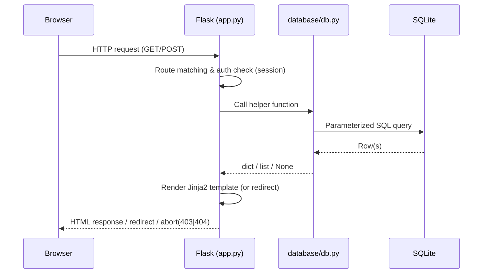
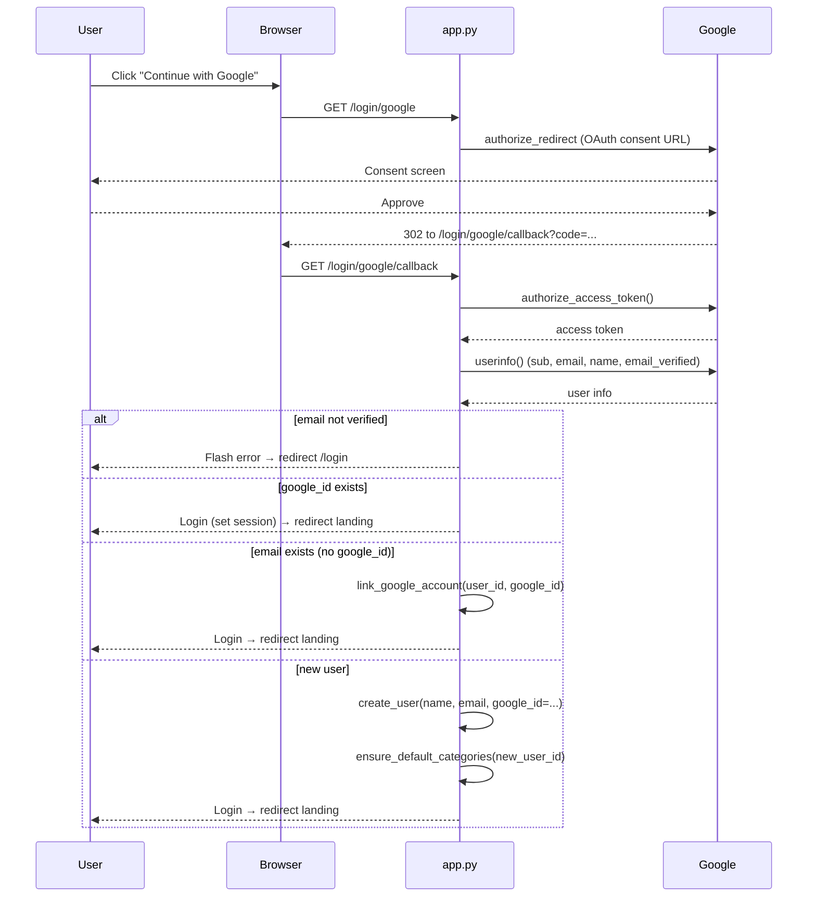
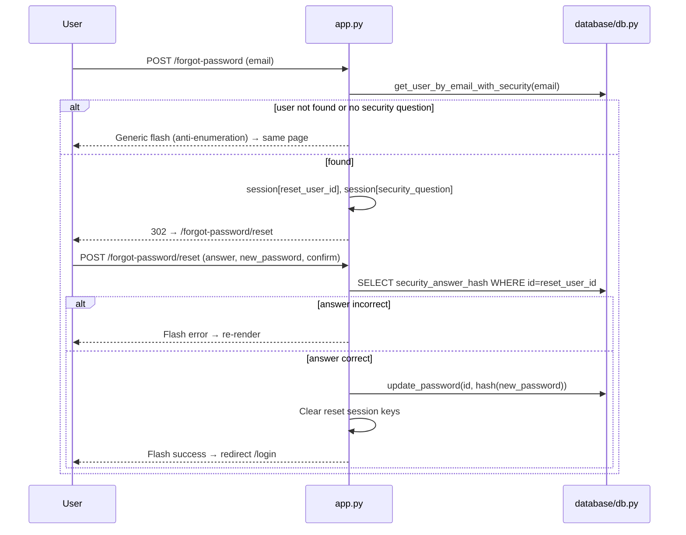

# 💰 Spendly — Project Documentation

> **Track every rupee. Know where it goes.**
>
> This document is a complete, code-derived reference for the Spendly project.
> It is intended for new developers who need to understand, run, maintain, and
> extend the application without any external guidance. Every statement below
> is based on the actual source code in this repository (last verified against
> the current state of the codebase — Dashboard, Expenses, Transactions,
> Categories, Reports, Budgets, Goals, and Settings modules).

---

## Table of Contents

1. [Project Overview](#1-project-overview)
2. [Features](#2-features)
3. [Technology Stack](#3-technology-stack)
4. [Architecture](#4-architecture)
5. [Folder Structure](#5-folder-structure)
6. [File-by-File Explanations](#6-file-by-file-explanations)
7. [Database Schema](#7-database-schema)
8. [Routes](#8-routes)
9. [Authentication & Authorization](#9-authentication--authorization)
10. [Key Workflows](#10-key-workflows)
11. [Frontend](#11-frontend)
12. [Backend](#12-backend)
13. [Configuration & Environment Variables](#13-configuration--environment-variables)
14. [Installation & Setup](#14-installation--setup)
15. [Dependencies](#15-dependencies)
16. [Security](#16-security)
17. [Error Handling](#17-error-handling)
18. [Testing](#18-testing)
19. [Deployment](#19-deployment)
20. [Known Issues & Limitations](#20-known-issues--limitations)
21. [Future Improvements](#21-future-improvements)

---

## 1. Project Overview

**Spendly** is a lightweight personal expense tracker built with **Flask** and
**SQLite**. Users can sign up with an email/password or "Continue with Google",
log expenses with amount/category/description/date/payment-method, manage
custom categories with icons and colors, browse a filterable, sortable,
paginated Transactions ledger, view rich spending insights (summary cards,
donut chart, top-category rankings, category analytics) across their Dashboard,
Expenses, Transactions, and Categories pages, and explore database-backed
analytics on the Reports and Budgets pages.

The project delivers:
- Full **Dashboard** (Profile) with date-filtered expense summary, recent
  transactions, and per-category spending breakdown.
- **Expense CRUD** with payment methods and an activity log.
- **Transactions ledger** with server-side search/filter/sort/pagination,
  bulk selection + delete, CSV export, a view modal, and a Recent Activity feed.
- **Categories module** with summary cards, a professional data table
  (icon, color, name, description, usage stats), donut chart, top-categories
  ranking, quick actions, add/edit forms with icon/color pickers, protected
  in-use deletion, merge, CSV export, and a dedicated analytics page.
- **Reports module** with database-backed analytics: summary cards, monthly
  spending trend line chart, current-vs-previous period bar chart, category
  and payment-method donut charts, top expenses table, monthly summary table,
  data-driven insight cards, and client-side PDF/Excel export.
- **Budgets module** with database-backed budget progress: per-category
  budget limits (static constants merged with per-user overrides), budget
  progress cards, Budget vs Actual bar chart, Budget Distribution donut,
  overview table, alerts/insights, and a recent activity timeline. Full
  CRUD routes (`/budgets/add`, `/budgets/<id>/edit`, `/budgets/<id>/delete`,
  `/budgets/reset`, `/budgets/export`) are implemented.

The project deliberately avoids heavy abstractions:

- A single `app.py` file contains **all** routes (no Flask blueprints).
- Raw `sqlite3` is used for persistence (no ORM / SQLAlchemy).
- Vanilla HTML/CSS/JavaScript is used for the frontend (no React, no npm, no build step).
- The whole application runs from a single Python process.

### Author context
The codebase contains README and CLAUDE.md files indicating the project was built
for a learning/portfolio context, but it is a fully functional application with
an authenticated app shell, real database persistence, and 192 passing tests.

---

## 2. Features

| Feature | Description |
|---|---|
| **Email/password sign-up** | Registration with name, email, password, and a mandatory security question/answer. |
| **Email/password sign-in** | Session-based login with generic error messages (no account enumeration). |
| **Google OAuth sign-in** | "Continue with Google" via Authlib. Auto-creates a new account or auto-links to an existing account by matching email. |
| **Password recovery** | Two-step flow: enter email → answer security question → set a new password. No email server required. |
| **App-shell UI** | Left sidebar (Dashboard, Expenses, Transactions, Categories, Reports, Budgets, Goals, Settings, plus Help placeholder), top header with search/theme/profile menu, responsive mobile drawer, collapsible sidebar. |
| **Theme switching** | Light / Dark / System theme persisted in `localStorage` (`spendly-theme`). |
| **Dashboard (Profile)** | Total spent (₹), transaction count, top category, recent 5 transactions, and a category breakdown with proportional bars. |
| **Date filtering** | Quick filters — All Time, This Month, Last 3 Months, Last 6 Months — plus a custom Start/End date range. |
| **Expense CRUD** | Add, view, edit, and delete expenses with amount, category, description, date, and payment method (card/upi/cash/bank/wallet). |
| **Expense list** | All expenses for a user, sorted newest-first, with per-category color tags and payment badges. |
| **Activity log** | `activities` table records added / edited / deleted events; surfaced on the Transactions Recent Activity panel. |
| **Transactions ledger** | Server-side filtered, sorted, paginated ledger with 5 summary cards, bulk selection, view modal, and CSV export. |
| **Categories module** | Summary cards, searchable/sortable/paginated table, donut chart, top-categories ranking, quick actions. |
| **Category CRUD** | Custom categories with Lucide icon + preset color; uniqueness per user; rename cascades to expense history. |
| **Protected deletion** | A category used by expenses requires explicit confirmation; expenses are reassigned to **Other**. |
| **Merge categories** | Reassign all expenses/activity from a source category into a target category, then remove the source. |
| **Category analytics** | Dedicated analytics page with spending distribution donut, ranking, and full breakdown table. |
| **CSV exports** | Export the filtered/selected Transactions ledger, or export all Categories with usage stats. |
| **Reports module** | Database-backed analytics with date/category/payment filters, 6 summary cards, monthly trend line chart, current-vs-prev bar chart, category & payment donuts, top expenses & monthly summary tables, data-driven insights, and client-side PDF/Excel export. |
| **Budgets module** | Database-backed budget progress with month/category/status filters, 4 summary cards, per-category progress cards, Budget vs Actual bar chart, Budget Distribution donut, overview table, alerts/insights, and a recent activity timeline. Full CRUD routes (`/budgets/add`, `/budgets/<id>/edit`, `/budgets/<id>/delete`, `/budgets/reset`, `/budgets/export`) are implemented. |
| **Goals module** | Savings goals with target amount, saved amount, deadline, category, and status (on-track/at-risk/completed/paused). Summary cards, filterable/sortable goal list, add/edit/delete/funds routes, CSV export, data-driven insights, and a recent activity timeline. |
| **Settings module** | Account settings page with theme preference, notification toggles, currency selector, data management (export/clear), password change, and account deletion. Full CRUD routes (`/settings/save`, `/settings/change-password`, `/settings/reset`, `/settings/export`, `/settings/clear-data`, `/settings/delete-account`) are implemented. |
| **Legal pages** | Terms & Conditions and Privacy Policy pages. |
| **Seed data** | A demo user (`demo@spendly.com` / `demo123`), 8 sample expenses with payment methods, matching activity records, and 7 default categories are inserted automatically on first run. |

---

## 3. Technology Stack

| Layer | Technology | Version / Notes |
|---|---|---|
| Backend framework | [Flask](https://flask.palletsprojects.com/) | `3.1.3` — single `app.py`, no blueprints |
| Database | SQLite (raw `sqlite3`) | File `expense_tracker.db` in project root; no ORM |
| Template engine | Jinja2 | Bundled with Flask |
| Frontend | Vanilla HTML / CSS / JS | No frameworks, no npm, no build step |
| Icons | [Lucide](https://lucide.dev/) | Loaded from CDN (`unpkg.com/lucide@latest`) |
| Fonts | Google Fonts | DM Serif Display + DM Sans |
| Password hashing | `werkzeug.security` | `generate_password_hash` / `check_password_hash` |
| OAuth | [Authlib](https://authlib.org/) | `authlib>=1.3.0`, Flask integration |
| Config loading | [python-dotenv](https://pypi.org/project/python-dotenv/) | `>=1.0.0` |
| HTTP client (OAuth) | `requests` | `>=2.28.0` (Authlib dependency) |
| Testing | [pytest](https://pytest.org/) + [pytest-flask](https://pypi.org/project/pytest-flask/) | `8.3.5` / `1.3.0` |
| Production WSGI | [Gunicorn](https://gunicorn.org/) | `23.0.0` |
| Language | Python | `3.10+` assumed (f-strings used) |

---

## 4. Architecture

Spendly follows a simple **route → helper → SQLite** layering:

```
 Browser / HTTP client
        │
        ▼
┌──────────────────────┐
│    app.py (Flask)    │  All routes, sessions, form validation, flash
│  ┌────────────────┐  │  messages, OAuth orchestration
│  │ Route handlers │  │
│  └───────┬────────┘  │
└──────────┼───────────┘
           │  imports database helpers
           ▼
┌──────────────────────┐
│  database/db.py      │  All SQL: schema, seed, CRUD, summary queries,
│  (raw sqlite3)       │  transactions ledger, category stats/merge/export,
│                      │  report data, budget data
└──────────┬───────────┘
           │  DATABASE_PATH = "expense_tracker.db"
           ▼
┌──────────────────────┐
│  SQLite database     │  Tables: users, expenses, activities, categories, budgets
└──────────────────────┘
```

### Request lifecycle (Mermaid)



### Module boundaries in `app.py`

| Module | Routes | Helpers used |
|---|---|---|
| Auth | `register`, `login`, `google_login`, `google_callback`, `logout` | `create_user`, `get_user_by_email`, `get_user_by_google_id`, `link_google_account` |
| Password reset | `forgot_password`, `reset_password` | `get_user_by_email_with_security`, `update_password` |
| Profile / Dashboard | `profile`, `profile_update`, `profile_change_password`, `profile_edit` | `get_user_by_id`, `update_user_profile`, `get_user_expenses_summary` |
| Expenses CRUD | `list_expenses`, `add_expense`, `edit_expense`, `delete_expense_view` | expense + category helpers, `add_activity` |
| Transactions | `transactions`, `transactions_export`, `transactions_bulk_delete` | `get_transactions`, `get_expenses_by_ids`, `delete_expenses_bulk`, `get_recent_activity`, `add_activity` |
| Categories | `categories`, `add_category`, `view_category`, `edit_category`, `delete_category_view`, `merge_categories_view`, `categories_export`, `categories_analytics` | category CRUD/stats/merge/export helpers |
| Reports | `reports` | `get_report_data`, `get_user_categories` |
| Budgets | `budgets`, `add_budget`, `edit_budget`, `delete_budget_view`, `reset_budgets`, `budgets_export` | `get_budget_data`, `get_budget_months`, `get_user_categories`, `create_budget`, `update_budget_limit`, `delete_budget`, `reset_budget_defaults` |
| Goals | `goals`, `add_goal`, `edit_goal`, `delete_goal_view`, `add_goal_funds_view`, `goals_export` | `get_goal_data`, `get_user_goals`, `get_goal_by_id`, `create_goal`, `update_goal`, `delete_goal`, `add_goal_funds` |
| Settings | `settings`, `settings_save`, `settings_change_password`, `settings_reset`, `settings_export`, `settings_clear_data`, `settings_delete_account` | `get_user_settings`, `update_user_settings`, `reset_user_settings`, `delete_user_data`, `delete_user_account` |

---

## 5. Folder Structure

```
spendly/
├── app.py                       # All routes — single file, no blueprints
├── requirements.txt             # Pinned dependencies
├── README.MD                    # Project readme (features, setup, routes)
├── PROJECT_DOCUMENTATION.md     # This document
├── CLAUDE.md                    # Agent/maintenance notes & conventions
├── implementation_plan.md       # Historical implementation plan for Step 06
├── .gitignore                   # Ignores venv/, *.db, __pycache__, .env, etc.
├── expense_tracker.db           # SQLite database (created at runtime, gitignored)
├── database/
│   ├── __init__.py              # Empty package marker
│   └── db.py                    # All DB logic: schema, seed, queries, helpers
├── templates/
│   ├── base.html                # Shared app-shell layout — every template extends this
│   ├── landing.html             # Public landing page (hero, features, modal)
│   ├── login.html               # Sign-in (email + Google OAuth button)
│   ├── register.html            # Registration with security question
│   ├── forgot_password.html     # Step 1: enter email
│   ├── reset_password.html      # Step 2: security answer + new password
│   ├── profile.html             # Dashboard: stats, filter bar, recent txns, categories
│   ├── profile_edit.html        # Edit profile (name/email) + change password
│   ├── privacy.html             # Privacy policy
│   ├── terms.html               # Terms & conditions
│   ├── transactions.html        # Transactions ledger (summary cards, filter bar, table, activity panel, modal)
│   ├── reports.html             # Reports dashboard (filter bar, summary cards, charts, tables, insights)
│   ├── budgets.html             # Budgets dashboard (filter bar, summary cards, progress, charts, table, insights)
│   ├── goals.html               # Goals dashboard (summary cards, filter bar, goal list, insights, activity)
│   ├── settings.html            # Settings dashboard (account, preferences, security, data management)
│   ├── expenses/
│   │   ├── list.html            # Expense list table
│   │   ├── form.html            # Add / Edit expense form (with payment method)
│   │   └── delete.html          # Delete confirmation page
│   └── categories/
│       ├── list.html            # Categories dashboard (summary cards, filter, table, donut, ranking, quick actions)
│       ├── form.html            # Add / Edit category form (icon + color pickers)
│       ├── view.html            # Single-category detail with usage stats
│       ├── delete.html          # Delete confirmation (protected when in use)
│       ├── merge.html           # Merge source → target category form
│       └── analytics.html       # Category analytics page
├── static/
│   ├── css/
│   │   ├── style.css            # Global styles, CSS variables, app shell, navbar/footer, auth, themes
│   │   ├── landing.css          # Landing hero, dashboard mockup, modal, features/CTA
│   │   ├── profile.css          # Profile dashboard, filter bar, stats, category bars, edit page
│   │   ├── expenses.css         # Expense table, form, delete confirmation, tags
│   │   ├── transactions.css     # Transactions ledger, filters, table, activity panel, modal
│   │   ├── categories.css       # Categories dashboard, forms, donut, ranking, merge, analytics
│   │   ├── reports.css          # Reports dashboard, filter bar, charts, tables, insights
│   │   ├── budgets.css          # Budgets dashboard, filter bar, progress cards, charts, table, insights
│   │   ├── goals.css            # Goals dashboard, filter bar, goal cards, progress bars, insights, timeline
│   │   └── settings.css         # Settings dashboard, section nav, forms, toggles, data management
│   └── js/
│       ├── main.js              # App shell JS — sidebar, drawer, dropdown, theme switch
│       ├── transactions.js      # Transactions UX — view modal, bulk selection, export link
│       ├── categories.js        # Categories UX — icon/color pickers, filter auto-submit, delete confirm
│       ├── reports.js           # Reports UX — chart/table rendering, export PDF/Excel, filter interactions
│       ├── budgets.js           # Budgets UX — progress cards, charts, table, insights, timeline, modals
│       └── goals.js             # Goals UX — progress bars, filter interactions, add funds, export
└── tests/
    ├── __init__.py              # Test package marker
    ├── conftest.py              # Pytest fixtures (app, client, db) + temp-DB isolation
    ├── test_backend_connection.py  # DB helpers + /profile route behavior (17 tests)
    ├── test_transactions.py        # Transactions backend (filters, sort, pagination, export, bulk delete, activity) (42 tests)
    ├── test_categories.py          # Categories backend (CRUD, stats, merge, export, analytics, routes) (45 tests)
    ├── test_budgets.py             # Budgets backend (CRUD, effective limits, budget data, routes, export) (41 tests)
    └── test_goals.py               # Goals backend (CRUD, progress, funds, data computation, routes, export) (47 tests)
```

> The `.env` file is referenced in docs and `.gitignore` but is **not committed**
> (contains `GOOGLE_CLIENT_ID` / `GOOGLE_CLIENT_SECRET`).

---

## 6. File-by-File Explanations

### 6.1 `app.py` (root)
The entire Flask application.

- **App creation**: `app = Flask(__name__)`; `SECRET_KEY` read from `SECRET_KEY` env var, defaulting to `"spendly-dev-secret-key"`.
- **OAuth setup**: Registers the `google` OAuth client using `GOOGLE_CLIENT_ID` / `GOOGLE_CLIENT_SECRET`, OpenID metadata URL, and scopes `openid email profile`.
- **Startup DB init**: With `app.app_context()`, calls `init_db()`, `seed_db()`, and `backfill_categories()` at import time.
- **Route handlers** (see [§8 Routes](#8-routes)):
  - Public/landing, terms, privacy, logout.
  - Auth: `register`, `login`, `google_login`, `google_callback`.
  - Password reset: `forgot_password`, `reset_password`.
  - Profile: `profile`, `profile_update`, `profile_change_password`, `profile_edit`.
  - Expenses: `list_expenses`, `add_expense`, `edit_expense`, `delete_expense_view`.
  - Transactions: `transactions`, `transactions_export`, `transactions_bulk_delete` + helper `_parse_transaction_filters`, `_transactions_query_args`.
  - Categories: `categories`, `add_category`, `view_category`, `edit_category`, `delete_category_view`, `merge_categories_view`, `categories_export`, `categories_analytics` + helper `_parse_category_filters`, `_category_query_args`.
  - Reports: `reports` + helper `_parse_report_filters`, `_report_query_args`.
  - Budgets: `budgets`, `add_budget`, `edit_budget`, `delete_budget_view`, `reset_budgets`, `budgets_export` + helper `_parse_budget_filters`, `_budget_query_args`.
  - Goals: `goals`, `add_goal`, `edit_goal`, `delete_goal_view`, `add_goal_funds_view`, `goals_export` + helper `_parse_goal_filters`, `_goal_query_args`.
  - Settings: `settings`, `settings_save`, `settings_change_password`, `settings_reset`, `settings_export`, `settings_clear_data`, `settings_delete_account`.
- **`login_required()` helper**: A plain function (not a decorator) that returns a redirect response if `session.get("user_id")` is absent, otherwise `None`. Each protected route calls it first.
- **Session keys used**: `user_id`, `user_name`, `reset_user_id`, `security_question`.
- **User-category aware forms**: The expense add/edit forms, the Transactions filter dropdown, the Reports filter dropdown, the Budgets page, and the Goals page all load the logged-in user's categories via `get_user_categories()` so custom categories appear alongside the defaults.
- **Run block**: `PORT` env var (default `5001`), `app.run(host="0.0.0.0", port=port)`.

### 6.2 `database/__init__.py`
Empty file — marks `database` as a Python package.

### 6.3 `database/db.py`
All database logic. Key constants:

| Symbol | Purpose |
|---|---|
| `DATABASE_PATH` | `"expense_tracker.db"` — overridden to a temp file in tests. |
| `CATEGORIES` | Legacy constant: `["Food", "Transport", "Bills", "Health", "Entertainment", "Shopping", "Other"]`. |
| `SECURITY_QUESTIONS` | 5 predefined questions for password recovery. |
| `PAYMENT_METHODS` | `["card", "upi", "cash", "bank", "wallet"]`; `DEFAULT_PAYMENT_METHOD = "cash"`. |
| `ACTIVITY_ACTIONS` | `("added", "edited", "deleted")` — allowed actions for the activity log. |
| `SORT_OPTIONS` | Whitelist for transaction sorting (date/amount/category × asc/desc). |
| `DEFAULT_CATEGORIES` | 7 default `(name, description, icon, hex_color)` tuples seeded for every user. |
| `CATEGORY_ICONS` | 22 Lucide icon names offered by the category icon picker. |
| `CATEGORY_COLORS` | 15 preset hex colors for category color picker. |
| `CATEGORY_SORT_OPTIONS` | Whitelist for category sorting (name/spent/count/created × asc/desc). |
| `BUDGET_LIMITS` | Static monthly budget limits per category (in ₹) — `Food: 8000`, `Transport: 4000`, `Bills: 6000`, `Health: 5000`, `Entertainment: 3000`, `Shopping: 5000`, `Other: 2000`. |
| `DEFAULT_BUDGET_LIMIT` | `2000.0` — default budget for any category not in `BUDGET_LIMITS`. |
| `BUDGET_STATUSES` | `("on-track", "warning", "over")` — whitelist for the Budgets page filter. |
| `BUDGET_TREND_MONTHS` | `6` — number of months shown in the Budget vs Actual trend chart. |
| `REPORT_DEFAULT_MONTHS` | `6` — default number of months for the Reports period. |
| `REPORT_PAYMENT_LABELS` | Maps payment method keys to display labels for Reports. |
| `REPORT_PAYMENT_COLORS` | Maps payment method keys to CSS color variables for Reports. |
| `MONTH_LABELS` | Full month names for budget/report month formatting. |
| `BUDGET_CATEGORY_COLORS` | Maps category names to CSS color variables for the Budgets UI. |
| `BUDGET_CATEGORY_ICONS` | Maps category names to Lucide icon names for the Budgets UI. |
| `GOAL_CATEGORIES` | 10 `(name, icon, color)` tuples for the Goals category picker (Emergency Fund, Travel, Home, Education, Health, Vehicle, Gadgets, Celebration, Investment, Other). |
| `GOAL_STATUSES` | `("on-track", "at-risk", "completed", "paused")` — whitelist for the Goals page filter. |
| `GOAL_SORT_OPTIONS` | Whitelist for goal sorting (progress-desc/asc, deadline-asc/desc, target-desc/asc, name-asc). |
| `GOAL_CATEGORY_ICONS` | Maps goal category names to Lucide icon names for the Goals UI. |
| `GOAL_CATEGORY_COLORS` | Maps goal category names to hex colors for the Goals UI. |
| `GOAL_CATEGORY_NAMES` | List of goal category names for dropdowns. |
| `DEFAULT_USER_SETTINGS` | Default settings values (`currency: "INR"`, etc.) used when creating a new `user_settings` row. |

Key functions:

| Function | Purpose |
|---|---|
| `get_db()` | Opens `sqlite3` connection with `timeout=10`, `row_factory = sqlite3.Row`, `PRAGMA foreign_keys = ON`. |
| `init_db()` | `CREATE TABLE IF NOT EXISTS` for **`users`, `expenses`, `activities`, `categories`, `budgets`, `goals`, `user_settings`**; adds `google_id`, `security_question`, `security_answer_hash`, and `payment_method` columns via `ALTER TABLE` guarded by `try/except`. |
| `seed_db()` | Inserts demo user + 8 sample expenses (with payment methods) + matching activity records + 7 default category rows **only if** the `users` table is empty. |
| `create_user(...)` | Inserts a user; returns new `id`; raises `IntegrityError` on duplicate email. Google-only users get `password_hash=""`. |
| `get_user_by_email` / `get_user_by_google_id` | Full user row by email / Google `sub` ID. |
| `link_google_account(user_id, google_id)` | Links `google_id` to a user; raises `ValueError` if already linked elsewhere. |
| `get_user_by_id(user_id)` | Returns `{id, name, email, created_at, member_since}` — `member_since` formatted `"Month YYYY"`. |
| `update_user_profile` / `update_password` | Name/email and password-hash updates (ownership scoped). |
| `get_user_by_email_with_security(email)` | `{id, security_question, security_answer_hash}` for the reset flow. |
| `get_user_expenses_summary(user_id, start_date, end_date)` | `{total_expenses, expense_count, top_category, category_breakdown, recent_expenses}` with date filtering. |
| `create_expense` | Inserts an expense; payment method validated against `PAYMENT_METHODS`. |
| `get_expenses_by_user` / `get_expense_by_id` | List a user's expenses / a single expense. |
| `update_expense` / `delete_expense` | Ownership-scoped update/delete (`id` + `user_id`). |
| `_build_transaction_filters` / `get_transactions` | Server-side ledger: search, category, date range, amount range, sort, pagination, filtered summary stats. |
| `get_expenses_by_ids` / `delete_expenses_bulk` | Ownership-scoped bulk fetch/delete for the Transactions bulk actions. |
| `ensure_default_categories(user_id)` | Seeds defaults + creates rows for any used-but-missing expense category names (migration safety). Idempotent. |
| `backfill_categories()` | Iterates all users and calls `ensure_default_categories()`. Called at app startup. |
| `get_user_categories(user_id)` | All category rows for dropdowns, ordered by name. |
| `create_category(user_id, name, description, icon, color)` | Inserts a category; raises `IntegrityError` on duplicate name (per user). |
| `get_category_by_id(category_id, user_id)` | Single category + `transaction_count`, `total_spent`, `avg_expense` (ownership scoped). |
| `update_category(...)` | Updates a category; renames existing expenses + activity entries on name change. |
| `delete_category(category_id, user_id, reassign=True)` | Deletes a category; when `reassign=True`, reassigns its expenses/activity to **Other**. |
| `get_categories(user_id, search, sort, page, per_page)` | Paginated categories with usage stats; search + whitelisted sort. |
| `get_category_stats(user_id)` | `{total_categories, most_used_category, highest_spending_category, unused_categories, total_spent, distribution, conic_gradient, ranking}`. |
| `get_categories_export(user_id)` | Flat rows (name, description, icon, color, created_at, stats) for CSV export. |
| `merge_categories(user_id, source_id, target_id)` | Reassigns source expenses/activity to target, deletes source. Returns `False` on self/invalid merge. |
| `get_user_budgets(user_id)` | All per-user budget rows for a user, ordered by category name. |
| `create_budget(user_id, category, limit)` | Upsert (INSERT ... ON CONFLICT DO UPDATE) a per-user budget row; returns the budget id. |
| `update_budget_limit(user_id, category, limit)` | Upsert a budget limit; returns `True` if a row was affected. |
| `delete_budget(user_id, category)` | Delete a per-user budget row; returns `True` if a row was deleted. |
| `reset_budget_defaults(user_id)` | Remove all per-user budget rows so defaults are used again; returns the number of rows removed. |
| `_effective_budget_limits(user_id)` | Merges per-user budget rows over static `BUDGET_LIMITS` defaults. |
| `get_budget_months(user_id)` | Distinct expense months (`YYYY-MM`) for the Budgets month filter dropdown. |
| `get_budget_data(user_id, month, category, status)` | Computes the full Budgets module data: per-category budgets with limits/spent/remaining/pct/status, summary cards, monthly trend, distribution, insights, activity timeline, and filter info. |
| `_compute_budget_insights(...)` | Generates data-driven alert/insight cards for the Budgets page. |
| `_format_activity_time(created_at)` | Formats an activity timestamp as a short relative label (Today/Yesterday/date). |
| `_build_report_filters` / `get_report_data(...)` | Computes full report data: summary cards, monthly trend, previous-period comparison, category & payment breakdowns, top expenses, monthly summary, insights, and filter info. |
| `_compute_period_range` / `_compute_prev_period` | Date-range helpers for the Reports period and previous-period comparison. |
| `_compute_insights(...)` | Generates data-driven insight cards for the Reports page. |
| `add_activity` / `get_recent_activity` | Record/read activity feed (validated against `ACTIVITY_ACTIONS`). |
| `get_user_goals` / `get_goal_by_id` | List/filter/sort goals for a user; single goal ownership-scoped. |
| `create_goal` / `update_goal` / `delete_goal` | Goal CRUD (ownership scoped). |
| `add_goal_funds` | Add funds to a goal's `saved_amount`; caps at target, marks completed if reached. |
| `get_goal_data` | Computes full Goals module data: goal list with progress/status, summary cards, insights, activity timeline, and filter info. |
| `_compute_goal_insights(...)` | Generates data-driven insight cards for the Goals page. |
| `_goal_status(saved, target, status)` | Returns the effective status key for a goal (completed/at-risk/on-track, respecting paused). |
| `get_user_settings` | Returns settings row for a user, creating defaults if none exist. |
| `update_user_settings` | Updates settings fields (theme, currency, notifications) for a user. |
| `reset_user_settings` | Deletes a user's settings row so defaults are recreated on next access. |
| `delete_user_data` | Deletes all financial data for a user (expenses, activities, budgets, goals, categories). |
| `delete_user_account` | Deletes a user's settings, all financial data, and the user row itself. |

All SQL uses `?` parameter placeholders — no string-formatted SQL.

### 6.4 `requirements.txt`
Pinned dependency manifest (see [§15 Dependencies](#15-dependencies)).

### 6.5 `README.MD`
Human-readable readme describing features, tech stack, structure, setup, routes, security notes, and constraints. The project's primary user-facing doc. **Note:** The README does not yet document the Reports, Budgets, Goals, or Settings modules.

### 6.6 `CLAUDE.md`
Maintenance guide containing architecture overview, code-style rules, tech constraints, route tables, security features, testing patterns, warnings, commands, and a subagent policy. Useful for AI-assisted development. **Note:** The CLAUDE.md does not yet document the Reports, Budgets, Goals, or Settings modules.

### 6.7 `implementation_plan.md`
Historical plan for "Step 06 — Backend Routes for Profile Page": documents the `member_since` formatting change, category percentage rounding, and creation of the test suite.

### 6.8 `TODO.md`
> **Note:** `TODO.md` is not present in the current file listing. If it exists, it may contain historical task tracking.

### 6.9 `.gitignore`
Ignores `venv/`, `expense_tracker.db`, `__pycache__/`, `*.pyc`, `*.pyo`, `.env`, `.DS_Store`, `.claude/plans/`.

### 6.10 Templates — `templates/`

| File | Purpose |
|---|---|
| `base.html` | Root app-shell layout: `<head>` with fonts + global CSS; pre-render theme script; left sidebar (brand, user card, nav with Dashboard/Expenses/Transactions/Categories/Reports/Budgets/Goals/Settings active states, "Soon" placeholder for Help), top header (hamburger, page title + breadcrumb, search, notifications, theme switch, profile dropdown), `<main>` → ``, lucide + `main.js` + theme persistence, ``. |
| `landing.html` | Public landing. Hero badge/title/subtitle, CTA buttons, mock dashboard visual, video modal (YouTube placeholder), feature cards, CTA section. |
| `login.html` | Sign-in card. Google button (links to `google_login`), divider, email/password form, "Forgot password?" link, register switch, flashed messages. |
| `register.html` | Registration form: name, email, password, confirm password, security question select, security answer. |
| `forgot_password.html` | Step 1 of recovery: email input posts to `forgot_password`. |
| `reset_password.html` | Step 2: security question, answer field, new password + confirmation. Guarded by session keys. |
| `profile.html` | Authenticated dashboard: user header, Edit Profile button, date filter bar, three stat cards, Recent Transactions table, By Category breakdown with bars. |
| `profile_edit.html` | Edit profile: avatar column, name/email inputs, change-password card, show/hide toggles, cancel/save footer. |
| `transactions.html` | Transactions ledger: page header (Add Transaction / Export), five summary cards, filter bar (search, category, date range, amount range, sort), bulk bar, table (date, description, category, payment, amount, actions), pagination, empty states, Recent Activity panel, view modal. |
| `reports.html` | Reports dashboard: page header (Generate Report / Export PDF / Export Excel), filter bar (date range, category, payment method), six summary cards, empty state, Spending Trends line chart, Monthly Comparison bar chart, By Category donut, By Payment Method donut, Top Expenses table, Monthly Summary table, Insights cards, Quick Actions, export toast. |
| `budgets.html` | Budgets dashboard: page header (Create Budget / Export PDF / Export Excel), filter bar (month, category, status), four summary cards, Budget Progress cards, Budget vs Actual bar chart, Budget Distribution donut, Budget Overview table, Alerts & Insights, Recent Budget Activity timeline, Quick Actions, Create Budget modal, toast. |
| `goals.html` | Goals dashboard: page header (Create Goal / Export), filter bar (category, status, sort), five summary cards, goal list table (name, category, target, saved, progress, deadline, status, actions), empty state, Insights cards, Quick Actions, Add Funds modal, toast. |
| `settings.html` | Settings dashboard: page header (Save Changes), section navigation (Account, Preferences, Security, Data), theme/notification/currency toggles, password change form, data export/clear actions, account deletion with confirmation. |
| `expenses/list.html` | Expense table (Date, Description, Category tag, Payment badge, Amount, Actions) or empty state with CTA. |
| `expenses/form.html` | Add/Edit expense form: amount, category (user categories), description, payment method, date (defaults today). |
| `expenses/delete.html` | Delete confirmation card with expense details and a destructive POST form. |
| `categories/list.html` | Categories dashboard: header (Add Category), four summary cards, search + sort + page-size filter bar, categories table (icon swatch, name, description, transactions, total spent, average, created, actions), pagination, empty states, quick actions (Create/Merge/Export/Analytics), Spending Distribution donut with legend, Top Categories ranking. |
| `categories/form.html` | Add/Edit category form: name, description, icon picker (Lucide grid), color picker (preset palette). |
| `categories/view.html` | Category detail: header with icon/name/description, Edit/Delete actions, three stat cards (Transactions, Total Spent, Average Expense), Category Details rows (name, icon, color, created, usage). |
| `categories/delete.html` | Delete confirmation: warning box when in use (reassign to **Other** explanation), details, confirm checkbox + disabled-but-unlockable delete button. |
| `categories/merge.html` | Merge form: source select, arrow, target select, warning box, submit/cancel. |
| `categories/analytics.html` | Category Analytics: header (Back to Categories), four summary cards, Spending Distribution donut + legend, Top Categories ranking, full breakdown table. |

### 6.11 Static assets — `static/`

| File | Purpose |
|---|---|
| `css/style.css` | Global stylesheet. Defines all CSS custom properties (colors, category tag/bar colors, fonts, radius, max-width), the light/dark/system theme system, theme switch, reset, app shell (sidebar, header, main), auth pages, Google button, legal pages, footer, responsive breakpoints. |
| `css/landing.css` | Landing-specific styles: hero, badge, highlight, actions, mock dashboard, summary cards, bars, video modal, features, CTA, responsive. |
| `css/profile.css` | Profile dashboard styles: filter bar, quick buttons, stat cards, two-column dashboard, table, category tags, category bars, empty state, edit profile page. |
| `css/expenses.css` | Expense list table, add/edit form, delete confirmation, category tag colors, empty state, action buttons. |
| `css/transactions.css` | Transactions ledger: header, 5 stat cards, two-column layout, filter bar, bulk bar, table, payment badges, pagination, empty states, activity panel, view modal, responsive. |
| `css/categories.css` | Categories module: dashboard header, 4 stat cards, two-column layout, filter bar, table (swatches, count badges), quick actions, donut (conic-gradient), legend, ranking, forms (icon/color grids), view page, delete confirmation, merge layout, analytics, responsive. |
| `css/reports.css` | Reports module: header, filter bar, 6 stat cards, charts layout (line chart, bar chart, donuts), tables layout, insights, quick actions, toast, responsive. |
| `css/budgets.css` | Budgets module: header, filter bar, 4 stat cards, progress cards, charts layout (bar chart, donut), overview table, alerts/insights, activity timeline, quick actions, modal, toast, responsive. |
| `css/goals.css` | Goals module: header, filter bar, 5 stat cards, goal cards with progress bars, insights, activity timeline, quick actions, modals, toast, responsive. |
| `css/settings.css` | Settings module: section navigation, account forms, preference toggles, security forms, data management actions, responsive. |
| `js/main.js` | App shell behavior: sidebar collapse/toggle, mobile drawer, profile dropdown, theme persistence, notification toggle, keyboard shortcut for search. |
| `js/transactions.js` | Transactions behavior: view modal population, bulk selection + select-all, export link builder, activity feed timestamps, filter auto-submit. |
| `js/categories.js` | Categories behavior: icon picker, color picker, debounced search auto-submit, sort/per-page auto-submit, reset filter, delete-confirmation checkbox state. |
| `js/reports.js` | Reports behavior: renders server-computed report data into line chart (SVG), bar chart, donut charts, and tables; loading skeletons; filter interactions; Generate Report / Export PDF / Export Excel buttons; export toast. |
| `js/budgets.js` | Budgets behavior: renders server-computed budget data into progress cards, bar chart, donut chart, overview table, alerts/insights, and activity timeline; create/edit/delete/reset modals; server-side filters; Export PDF / Export Excel; toast. |
| `js/goals.js` | Goals behavior: renders server-computed goal data into goal cards with progress bars, insights, and activity timeline; filter interactions; add funds modal; Export CSV; toast. |
| `js/settings.js` | Settings behavior: renders server-computed settings data, handles section navigation, form validation, theme/currency/notification toggles, password change, data export/clear/delete actions, and toast notifications. |

### 6.12 Tests — `tests/`

| File | Purpose |
|---|---|
| `__init__.py` | Marks `tests` as a Python package. |
| `conftest.py` | Sets up pytest-flask. Inserts project root on `sys.path`, creates a temp DB via `tempfile.mkstemp()`, and **patches `db_module.DATABASE_PATH` before app import** so tests never touch the real DB. The `app` fixture runs `init_db()`, then resets all rows (`activities`, `expenses`, `categories`, `users`, `budgets`, `goals`, `user_settings`) with row-level `DELETE` and resets `sqlite_sequence`, then re-seeds — so `user_id == 1` is always the demo user. Fixtures: `app`, `client`, `db`. |
| `test_backend_connection.py` | 17 tests across 3 classes: `TestGetUserById`, `TestGetUserExpensesSummary`, `TestProfileRoute`. |
| `test_transactions.py` | 42 tests across 8 classes: payment persistence, `get_transactions` filters/sort/pagination/summary, bulk ops, activity log, Transactions routes (render, export, bulk delete), and expense CRUD payment routes. |
| `test_categories.py` | 45 tests across 8 classes: default/backfill categories, category CRUD, `get_categories`, `get_category_stats`, export/merge, and the Categories routes (render, CRUD, merge, export, analytics). |
| `test_budgets.py` | 41 tests across 6 classes: budget CRUD helpers, effective budget limits, `get_budget_data` computation, Budgets routes (render, filters, CRUD, export). |
| `test_goals.py` | 47 tests across 7 classes: goal CRUD helpers, progress/status computation, `add_goal_funds`, `get_goal_data` computation, Goals routes (render, filters, CRUD, funds, export). |

> **Total: 192 tests** across 5 test files.

---

## 7. Database Schema

The schema is created by `init_db()` in `database/db.py`. SQLite file: `expense_tracker.db`.

```mermaid
erDiagram
    users {
        INTEGER id PK "AUTOINCREMENT"
        TEXT name "NOT NULL"
        TEXT email "UNIQUE NOT NULL"
        TEXT password_hash "NOT NULL ('' for Google-only)"
        TEXT created_at "DEFAULT datetime('now')"
        TEXT google_id "added via ALTER TABLE"
        TEXT security_question "added via ALTER TABLE"
        TEXT security_answer_hash "added via ALTER TABLE"
    }

    expenses {
        INTEGER id PK "AUTOINCREMENT"
        INTEGER user_id FK "NOT NULL REFERENCES users(id)"
        REAL amount "NOT NULL"
        TEXT category "NOT NULL"
        TEXT date "NOT NULL (YYYY-MM-DD)"
        TEXT description "nullable, max 200"
        TEXT payment_method "DEFAULT 'cash'"
        TEXT created_at "DEFAULT datetime('now')"
    }

    activities {
        INTEGER id PK "AUTOINCREMENT"
        INTEGER user_id FK "NOT NULL REFERENCES users(id)"
        TEXT action "added | edited | deleted"
        INTEGER expense_id "nullable"
        TEXT category "nullable"
        TEXT description "nullable"
        REAL amount "nullable"
        TEXT created_at "DEFAULT datetime('now')"
    }

    categories {
        INTEGER id PK "AUTOINCREMENT"
        INTEGER user_id FK "NOT NULL REFERENCES users(id)"
        TEXT name "NOT NULL"
        TEXT description "DEFAULT ''"
        TEXT icon "DEFAULT 'tag'"
        TEXT color "DEFAULT '#1a472a'"
        TEXT created_at "DEFAULT datetime('now')"
    }

    budgets {
        INTEGER id PK "AUTOINCREMENT"
        INTEGER user_id FK "NOT NULL REFERENCES users(id)"
        TEXT category "NOT NULL"
        REAL limit_amount "NOT NULL"
        TEXT period "DEFAULT 'monthly'"
        INTEGER is_default "DEFAULT 0"
        TEXT created_at "DEFAULT datetime('now')"
    }

    goals {
        INTEGER id PK "AUTOINCREMENT"
        INTEGER user_id FK "NOT NULL REFERENCES users(id)"
        TEXT name "NOT NULL"
        TEXT category "NOT NULL"
        REAL target_amount "NOT NULL"
        REAL saved_amount "DEFAULT 0.0"
        TEXT deadline "NOT NULL (YYYY-MM-DD)"
        TEXT status "DEFAULT 'on-track'"
        TEXT created_at "DEFAULT datetime('now')"
        TEXT updated_at "DEFAULT datetime('now')"
    }

    user_settings {
        INTEGER id PK "AUTOINCREMENT"
        INTEGER user_id FK "NOT NULL REFERENCES users(id)"
        TEXT theme "DEFAULT 'dark'"
        TEXT currency "DEFAULT 'INR'"
        INTEGER notifications "DEFAULT 1"
        TEXT created_at "DEFAULT datetime('now')"
        TEXT updated_at "DEFAULT datetime('now')"
    }

    users ||--o{ expenses : "owns"
    users ||--o{ activities : "logs"
    users ||--o{ categories : "defines"
    users ||--o{ budgets : "configures"
    users ||--o{ goals : "sets"
    users ||--o{ user_settings : "has"
```



### 7.1 `users` table

| Column | Type | Constraints | Notes |
|---|---|---|---|
| `id` | INTEGER | PRIMARY KEY AUTOINCREMENT | |
| `name` | TEXT | NOT NULL | Display name |
| `email` | TEXT | UNIQUE NOT NULL | Login identifier |
| `password_hash` | TEXT | NOT NULL | Werkzeug hash; `""` for Google-only accounts |
| `created_at` | TEXT | DEFAULT `datetime('now')` | ISO timestamp `YYYY-MM-DD HH:MM:SS` |
| `google_id` | TEXT | nullable | Added by `ALTER TABLE` migration; unique per linked Google account (enforced in app code) |
| `security_question` | TEXT | nullable | Added by migration |
| `security_answer_hash` | TEXT | nullable | Added by migration; hashed + case-normalized |

### 7.2 `expenses` table

| Column | Type | Constraints | Notes |
|---|---|---|---|
| `id` | INTEGER | PRIMARY KEY AUTOINCREMENT | |
| `user_id` | INTEGER | NOT NULL REFERENCES `users(id)` | FK enforced per connection |
| `amount` | REAL | NOT NULL | Stored as float; validated `> 0` in routes |
| `category` | TEXT | NOT NULL | Category name (defaults or custom) |
| `date` | TEXT | NOT NULL | `YYYY-MM-DD` (expense date) |
| `description` | TEXT | nullable | Limited to 200 chars server-side |
| `payment_method` | TEXT | DEFAULT `'cash'` | One of `card`, `upi`, `cash`, `bank`, `wallet` |
| `created_at` | TEXT | DEFAULT `datetime('now')` | Insert timestamp |

### 7.3 `activities` table

| Column | Type | Constraints | Notes |
|---|---|---|---|
| `id` | INTEGER | PRIMARY KEY AUTOINCREMENT | |
| `user_id` | INTEGER | NOT NULL REFERENCES `users(id)` | FK enforced per connection |
| `action` | TEXT | NOT NULL | `added`, `edited`, or `deleted` |
| `expense_id` | INTEGER | nullable | Related expense (if any) |
| `category` | TEXT | nullable | Category name at time of action |
| `description` | TEXT | nullable | Snapshot of the expense description |
| `amount` | REAL | nullable | Snapshot of the expense amount |
| `created_at` | TEXT | DEFAULT `datetime('now')` | Action timestamp |

### 7.4 `categories` table

| Column | Type | Constraints | Notes |
|---|---|---|---|
| `id` | INTEGER | PRIMARY KEY AUTOINCREMENT | |
| `user_id` | INTEGER | NOT NULL REFERENCES `users(id)` | FK enforced per connection |
| `name` | TEXT | NOT NULL, `UNIQUE(user_id, name)` | Case-insensitive uniqueness enforced at app layer |
| `description` | TEXT | DEFAULT `''` | Optional description |
| `icon` | TEXT | DEFAULT `'tag'` | Lucide icon name |
| `color` | TEXT | DEFAULT `'#1a472a'` | Hex color for swatches / charts |
| `created_at` | TEXT | DEFAULT `datetime('now')` | Creation timestamp |

### 7.5 `budgets` table

| Column | Type | Constraints | Notes |
|---|---|---|---|
| `id` | INTEGER | PRIMARY KEY AUTOINCREMENT | |
| `user_id` | INTEGER | NOT NULL REFERENCES `users(id)` | FK enforced per connection |
| `category` | TEXT | NOT NULL, `UNIQUE(user_id, category)` | Category name |
| `limit_amount` | REAL | NOT NULL | Monthly budget limit in ₹ |
| `period` | TEXT | DEFAULT `'monthly'` | Budget period |
| `is_default` | INTEGER | DEFAULT `0` | Whether this is a default budget row |
| `created_at` | TEXT | DEFAULT `datetime('now')` | Creation timestamp |

### 7.6 `goals` table

| Column | Type | Constraints | Notes |
|---|---|---|---|
| `id` | INTEGER | PRIMARY KEY AUTOINCREMENT | |
| `user_id` | INTEGER | NOT NULL REFERENCES `users(id)` | FK enforced per connection |
| `name` | TEXT | NOT NULL | Goal name |
| `category` | TEXT | NOT NULL | Goal category |
| `target_amount` | REAL | NOT NULL | Target savings amount in ₹ |
| `saved_amount` | REAL | DEFAULT `0.0` | Current saved amount in ₹ |
| `deadline` | TEXT | NOT NULL | `YYYY-MM-DD` (goal deadline) |
| `status` | TEXT | DEFAULT `'on-track'` | `on-track`, `at-risk`, `completed`, or `paused` |
| `created_at` | TEXT | DEFAULT `datetime('now')` | Creation timestamp |
| `updated_at` | TEXT | DEFAULT `datetime('now')` | Last update timestamp |

### 7.7 `user_settings` table

| Column | Type | Constraints | Notes |
|---|---|---|---|
| `id` | INTEGER | PRIMARY KEY AUTOINCREMENT | |
| `user_id` | INTEGER | NOT NULL REFERENCES `users(id)` | FK enforced per connection |
| `theme` | TEXT | DEFAULT `'dark'` | `light`, `dark`, or `system` |
| `currency` | TEXT | DEFAULT `'INR'` | Currency code |
| `notifications` | INTEGER | DEFAULT `1` | Boolean flag for notifications |
| `created_at` | TEXT | DEFAULT `datetime('now')` | Creation timestamp |
| `updated_at` | TEXT | DEFAULT `datetime('now')` | Last update timestamp |

### 7.6 Seed data (`seed_db()`)

Demo user:
- **Name:** Demo User · **Email:** `demo@spendly.com` · **Password:** `demo123`
- **Security question:** "What is your pet's name?" · **Answer:** `fido` (hashed)

Eight sample expenses (amounts total **₹5,170.00**, 8 transactions, top category **Bills**, most-used category **Food**):

| Amount (₹) | Category | Days ago | Description | Payment |
|---:|---|---|---|---|
| 450.00 | Food | 28 | Weekly groceries | upi |
| 150.00 | Transport | 25 | Bus pass recharge | cash |
| 2000.00 | Bills | 20 | Electricity bill | bank |
| 600.00 | Health | 18 | Pharmacy — medicines | card |
| 350.00 | Entertainment | 14 | Movie tickets | wallet |
| 1200.00 | Shopping | 10 | New headphones | card |
| 320.00 | Food | 5 | Dinner at pizzeria | upi |
| 100.00 | Other | 2 | Miscellaneous | cash |

Matching `activities` rows (`action = 'added'`) are inserted for the Recent Activity feed, and the 7 `DEFAULT_CATEGORIES` rows are inserted for the demo user.

---

## 8. Routes

All routes are defined in `app.py`. Total: **49 routes** (plus helper functions).

### 8.1 Public & Auth

| Route | Methods | View function | Description |
|---|---|---|---|
| `/` | GET | `landing` | Renders the public landing page. |
| `/register` | GET, POST | `register` | Show registration form / create account. Redirects logged-in users to landing. Validates name, email (`@`), password match + ≥ 8 chars, security question/answer. On success flashes and redirects to login (does **not** auto-login). |
| `/login` | GET, POST | `login` | Show login form / authenticate. Redirects logged-in users to landing. Generic "Invalid email or password." on failure. Sets `session["user_id"]` and `session["user_name"]`, redirects to `/profile`. |
| `/login/google` | GET | `google_login` | Redirects to Google's OAuth consent screen (`authorize_redirect`). |
| `/login/google/callback` | GET | `google_callback` | OAuth callback. Verifies `email_verified`; looks up by `google_id`, then by email (auto-link), else creates a user. Sets session and redirects to landing. |
| `/logout` | GET | `logout` | `session.clear()`, flashes "You have been logged out.", redirects to landing. |

### 8.2 Password Reset

| Route | Methods | View function | Description |
|---|---|---|---|
| `/forgot-password` | GET, POST | `forgot_password` | Step 1: enter email. Looks up user via `get_user_by_email_with_security`; stores `reset_user_id` + `security_question` in session and redirects to reset. Generic flash prevents enumeration. |
| `/forgot-password/reset` | GET, POST | `reset_password` | Step 2: answer security question + set new password. Guards on session keys. Normalizes answer, compares hash, validates new password, calls `update_password`, clears reset session keys, redirects to login. |

### 8.3 Profile / Dashboard

| Route | Methods | View function | Description |
|---|---|---|---|
| `/profile` | GET | `profile` | Requires auth. Clears orphaned sessions. Supports `period` (`1m`/`3m`/`6m`/`all`) and `start_date`/`end_date` query params. Computes summary via `get_user_expenses_summary` and renders dashboard. |
| `/profile/update` | POST | `profile_update` | Legacy endpoint: updates name/email only. Enforces email uniqueness; updates `session["user_name"]`. |
| `/profile/change-password` | POST | `profile_change_password` | Legacy endpoint: changes password after verifying `current_password`. |
| `/profile/edit` | GET, POST | `profile_edit` | Combined edit screen. POST always updates name/email; if any password field is provided, all three are required and the password is updated after verifying current password. |

### 8.4 Expense CRUD

| Route | Methods | View function | Description |
|---|---|---|---|
| `/expenses` | GET | `list_expenses` | Requires auth. Lists all expenses for the user, newest first, with payment badges. |
| `/expenses/add` | GET, POST | `add_expense` | Requires auth. Validates amount (> 0 float), category (must be one of the user's categories), date, description (≤ 200 chars), payment method. Logs an "added" activity. |
| `/expenses/<int:id>/edit` | GET, POST | `edit_expense` | Requires auth. `abort(404)` if missing, `abort(403)` if owned by another user. Same validation as add. Logs an "edited" activity. |
| `/expenses/<int:id>/delete` | GET, POST | `delete_expense_view` | Requires auth. `abort(404)`/`abort(403)` checks. GET shows confirmation; POST deletes and logs a "deleted" activity. |

### 8.5 Transactions

| Route | Methods | View function | Description |
|---|---|---|---|
| `/transactions` | GET | `transactions` | Requires auth. Server-side search, category filter, date range, amount range, sort, pagination (8/page). Renders the ledger; Recent Activity panel reflects the active category filter. |
| `/transactions/export` | GET | `transactions_export` | Requires auth. CSV export of the filtered set (same query params) or selected `ids` (ownership enforced). Returns `text/csv` attachment. |
| `/transactions/bulk-delete` | POST | `transactions_bulk_delete` | Requires auth. Deletes selected `expense_ids` (ownership enforced), logs a "deleted" activity per row, redirects back preserving filters. |

### 8.6 Categories

| Route | Methods | View function | Description |
|---|---|---|---|
| `/categories` | GET | `categories` | Requires auth. Renders the categories dashboard with summary cards, filtered/sorted/paginated table, donut distribution, ranking, and quick actions. |
| `/categories/add` | GET, POST | `add_category` | Requires auth. Validates name (required, ≤ 30 chars, no duplicates per user), description (≤ 160), icon (must be in `CATEGORY_ICONS`), color (must be in `CATEGORY_COLORS`). |
| `/categories/<int:category_id>` | GET | `view_category` | Requires auth. `abort(404)` if missing or not owned. Renders category detail with usage stats. |
| `/categories/<int:category_id>/edit` | GET, POST | `edit_category` | Requires auth. `abort(404)`/`abort(403)` checks. Same validation as add. Renaming cascades to expenses + activity log. |
| `/categories/<int:category_id>/delete` | GET, POST | `delete_category_view` | Requires auth. `abort(404)`/`abort(403)` checks. GET shows confirmation; when the category is in use, deletion requires the `confirm` checkbox and regenerates to "Other". |
| `/categories/merge` | GET, POST | `merge_categories_view` | Requires auth. Merge form + POST handler. Reassigns source → target, deletes source. Errors on same/invalid ids. |
| `/categories/export` | GET | `categories_export` | Requires auth. CSV export of all categories with usage stats (`Name`, `Description`, `Icon`, `Color`, `Created`, `Transactions`, `Total Spent`, `Average`). |
| `/categories/analytics` | GET | `categories_analytics` | Requires auth. Renders the analytics page with summary cards, donut distribution, ranking, and full breakdown table. |

### 8.7 Reports

| Route | Methods | View function | Description |
|---|---|---|---|
| `/reports` | GET | `reports` | Requires auth. Renders the Reports dashboard with database-backed analytics. Supports optional `date_from`, `date_to`, `category`, and `payment` filters via GET query params. Computes summary cards, monthly trend, previous-period comparison, category & payment breakdowns, top expenses, monthly summary, and data-driven insights via `get_report_data`. |

### 8.8 Budgets

| Route | Methods | View function | Description |
|---|---|---|---|
| `/budgets` | GET | `budgets` | Requires auth. Renders the Budgets dashboard with database-backed analytics. Supports optional `month`, `category`, and `status` filters via GET query params. Computes budget progress cards, summary cards, Budget vs Actual trend, Budget Distribution donut, overview table, alerts/insights, and recent activity via `get_budget_data`. |
| `/budgets/add` | POST | `add_budget` | Requires auth. Validates category (must be in `BUDGET_LIMITS`) and positive limit. Creates a per-user budget row via `create_budget`. Redirects back to `/budgets`. |
| `/budgets/<int:budget_id>/edit` | POST | `edit_budget` | Requires auth. `abort(404)` if missing or not owned. Validates limit (> 0). Updates via `update_budget_limit`. Redirects back. |
| `/budgets/<int:budget_id>/delete` | POST | `delete_budget_view` | Requires auth. `abort(404)` if missing or not owned. Deletes via `delete_budget`. Redirects back. |
| `/budgets/reset` | POST | `reset_budgets` | Requires auth. Removes all per-user budget rows via `reset_budget_defaults`, reverting to static defaults. Redirects back. |
| `/budgets/export` | GET | `budgets_export` | Requires auth. CSV export of all budgets with category, limit, period, and created date. |

### 8.9 Goals

| Route | Methods | View function | Description |
|---|---|---|---|
| `/goals` | GET | `goals` | Requires auth. Renders the Goals dashboard with database-backed data. Supports optional `status`, `category`, and `sort` filters via GET query params. Computes summary cards, goal list with progress, insights, and activity timeline via `get_goal_data`. |
| `/goals/add` | POST | `add_goal` | Requires auth. Validates name, category (must be in `GOAL_CATEGORY_NAMES`), target (> 0), saved (≤ target), and deadline (`YYYY-MM-DD`). Creates via `create_goal`. Redirects back preserving filters. |
| `/goals/<int:goal_id>/edit` | POST | `edit_goal` | Requires auth. `abort(404)` if missing or not owned. Same validation as add. Updates via `update_goal`. Redirects back. |
| `/goals/<int:goal_id>/delete` | POST | `delete_goal_view` | Requires auth. `abort(404)` if missing or not owned. Deletes via `delete_goal`. Redirects back. |
| `/goals/<int:goal_id>/funds` | POST | `add_goal_funds_view` | Requires auth. `abort(404)` if missing or not owned. Validates positive amount. Adds funds via `add_goal_funds` (caps at target, marks completed if reached). Redirects back. |
| `/goals/export` | GET | `goals_export` | Requires auth. CSV export of all goals with name, category, target, saved, progress, deadline, and status. |

### 8.10 Settings

| Route | Methods | View function | Description |
|---|---|---|---|
| `/settings` | GET | `settings` | Requires auth. Renders the Settings dashboard. Loads user preferences via `get_user_settings`. |
| `/settings/save` | POST | `settings_save` | Requires auth. Validates and updates theme, currency, and notification preferences via `update_user_settings`. Redirects back. |
| `/settings/change-password` | POST | `settings_change_password` | Requires auth. Verifies current password, validates new password (≥ 8 chars, match), updates via `update_password`. Redirects back. |
| `/settings/reset` | POST | `settings_reset` | Requires auth. Resets all settings to defaults via `reset_user_settings`. Redirects back. |
| `/settings/export` | GET | `settings_export` | Requires auth. Exports user data (settings, expenses, categories, budgets, goals) as JSON. |
| `/settings/clear-data` | POST | `settings_clear_data` | Requires auth. Deletes all financial data (expenses, activities, budgets, goals, categories) via `delete_user_data`. Settings row is preserved. Redirects back. |
| `/settings/delete-account` | POST | `settings_delete_account` | Requires auth. Permanently deletes the user account and all associated data via `delete_user_account`. Redirects to landing. |

### 8.11 Legal / Static

| Route | Methods | View function | Description |
|---|---|---|---|
| `/terms` | GET | `terms` | Renders Terms & Conditions. |
| `/privacy` | GET | `privacy` | Renders Privacy Policy. |

---

## 9. Authentication & Authorization

### 9.1 Model
- **Session-based authentication** using Flask's signed cookie session.
- On successful login/registration-via-Google, the server stores `session["user_id"]` and `session["user_name"]`.
- **Authorization** is checked per route via the `login_required()` helper (defined in `app.py`):

```python
def login_required():
    if not session.get("user_id"):
        flash("Please sign in to access this page.", "error")
        return redirect(url_for("login"))
    return None
```

Every protected route calls `redirect_resp = login_required()` and returns `redirect_resp` if it is not `None`.

### 9.2 Ownership scoping
- **Expenses**: edit/delete use `WHERE id = ? AND user_id = ?`; route-level `abort(403)` when `expense["user_id"] != session["user_id"]`.
- **Transactions**: all queries are scoped by `user_id`; bulk ops verify each id belongs to the user.
- **Categories**: `get_category_by_id(category_id, user_id)`, `update_category(category_id, user_id, ...)`, `delete_category(category_id, user_id, ...)` all enforce ownership; routes `abort(404)` for missing/foreign resources.
- **Reports**: all queries are scoped by `user_id`.
- **Budgets**: all queries are scoped by `user_id`; CRUD routes verify ownership via `abort(404)`.
- **Goals**: all queries are scoped by `user_id`; CRUD routes verify ownership via `abort(404)`.
- **Settings**: all operations are scoped by `user_id`; `delete_user_account` removes only the current user's data.

### 9.3 Google OAuth flow (Mermaid)



### 9.4 Password reset flow (Mermaid)



### 9.5 Session keys reference

| Key | Set by | Cleared by | Purpose |
|---|---|---|---|
| `user_id` | login, Google callback | logout / `session.clear()` | Authenticated user's primary key |
| `user_name` | login, Google callback, profile update/edit | logout | Display name for navbar/sidebar chip |
| `reset_user_id` | forgot-password | reset_password, logout | Identity for the reset step |
| `security_question` | forgot-password | reset_password, logout | Question shown on reset step |

---

## 10. Key Workflows

### 10.1 Registration
1. User fills the `/register` form (name, email, password, confirm password, security question, answer).
2. Server validates: all required, `@` in email, passwords match, password ≥ 8 chars, question/answer present.
3. `create_user(...)` is called with `generate_password_hash(password)` and `generate_password_hash(security_answer.strip().lower())`.
4. Duplicate email raises `sqlite3.IntegrityError` → "Email already registered."
5. Success: flash + redirect to `/login` (no auto-login).

### 10.2 Login
1. POST email + password to `/login`.
2. `get_user_by_email(email)`; if missing or `check_password_hash` fails → generic error.
3. Success: set `user_id`/`user_name`; redirect to `/profile`.

### 10.3 Add / Edit / Delete expense
- **Add:** POST to `/expenses/add`; validate amount/category/date/description/payment-method; insert via `create_expense`; log `added` activity.
- **Edit:** GET `/expenses/<id>/edit` shows pre-filled form; POST updates with `update_expense(id, user_id, ...)`. Ownership enforced (`abort(403)`); logs `edited` activity.
- **Delete:** GET shows confirmation; POST executes `delete_expense(id, user_id)`; logs `deleted` activity.

### 10.4 Transactions ledger
1. `GET /transactions` — auth check.
2. `_parse_transaction_filters()` reads and validates `search`, `category`, `date_from`, `date_to`, `amount_min`, `amount_max`, `sort`, `page`.
3. `get_transactions(user_id, **filters)` runs a parameterized query that counts matching rows, computes filtered summary statistics, and returns the current page.
4. The template renders five summary cards from the filtered set, the filter form (values preserved), the table, pagination, and the Recent Activity panel (filtered by active category).

### 10.5 CSV exports
- **Transactions:** `GET /transactions/export` re-uses the same filters. If `ids` are provided, only those (ownership-scoped) rows are exported; otherwise the full filtered set (`per_page=None`) is exported as `spendly-transactions.csv`.
- **Categories:** `GET /categories/export` returns all categories with name/description/icon/color/created date/transaction count/total spent/average as a `text/csv` attachment.

### 10.6 Category CRUD
- **Default seeding:** `create_user` → `ensure_default_categories` for Google-only new users; `seed_db` inserts default rows for the demo user; `backfill_categories()` at startup ensures every pre-existing user gets defaults (also creating rows for legacy expense category names).
- **Add:** `/categories/add` POST validates name/description/icon/color; duplicate name raises `IntegrityError` → friendly flash.
- **Edit:** `/categories/<id>/edit` — changing the name cascades `UPDATE expenses SET category = <newname>` and `UPDATE activities SET category = <newname>` so history stays coherent.
- **Delete (protected):** `GET /categories/<id>/delete` — if the category is used by expenses, the page requires a `confirm` checkbox; unconfirmed POST is rejected. On confirmed delete, expenses + activity are reassigned to **Other**, then the category row is removed.

### 10.7 Merge categories
1. `GET /categories/merge` shows source/target selects.
2. `POST /categories/merge` calls `merge_categories(user_id, source_id, target_id)`.
3. All expenses and activity entries using the source name are reassigned to the target name, then the source category row is deleted. Self-merges and invalid ids are rejected.

### 10.8 Viewing insights (Dashboard)
1. `GET /profile` — auth check, orphaned-session cleanup.
2. Parse `period` or `start_date`/`end_date`; compute date range for `1m`/`3m`/`6m`; validate date format.
3. `get_user_expenses_summary(user_id, start_date, end_date)` returns totals, count, top category, category breakdown (by total desc), and last 5 expenses.
4. Template renders stat cards, recent transactions table, and proportional category bars.

### 10.9 Reports
1. `GET /reports` — auth check.
2. `_parse_report_filters()` reads and validates `date_from`, `date_to`, `category`, `payment`.
3. `get_report_data(user_id, date_from, date_to, category, payment, months=6)` computes summary cards, monthly trend, previous-period comparison, category & payment breakdowns, top expenses, monthly summary, and insights.
4. The template renders the filter bar, six summary cards, charts (line, bar, donuts), tables, and insights. `reports.js` renders the charts/tables client-side from `window.SPENDLY_REPORTS.report` and handles Export PDF / Export Excel.

### 10.10 Budgets
1. `GET /budgets` — auth check.
2. `_parse_budget_filters()` reads and validates `month`, `category`, `status`.
3. `get_budget_data(user_id, month, category, status)` computes per-category budgets (static `BUDGET_LIMITS` merged with per-user rows), summary cards, monthly trend, distribution, insights, and activity timeline.
4. The template renders the filter bar, four summary cards, progress cards, charts, overview table, alerts/insights, and activity timeline. `budgets.js` renders these client-side from `window.SPENDLY_BUDGETS.budget` and handles create/edit/delete/reset modals, server-side filters, and Export PDF / Export Excel.

### 10.11 Goals
1. `GET /goals` — auth check.
2. `_parse_goal_filters()` reads and validates `status`, `category`, `sort`.
3. `get_goal_data(user_id, status, category, sort)` computes goal list with progress/effective status, summary cards, insights, and activity timeline.
4. The template renders the filter bar, five summary cards, goal table, insights, and activity timeline. `goals.js` renders these client-side from `window.SPENDLY_GOALS.goal` and handles add funds modal, filters, and Export CSV.

### 10.12 Settings
1. `GET /settings` — auth check.
2. `get_user_settings(user_id)` loads the user's settings row (creating defaults if needed).
3. POST routes handle save (`update_user_settings`), change-password (`update_password`), reset (`reset_user_settings`), export (JSON), clear-data (`delete_user_data`), and delete-account (`delete_user_account`).
4. The template renders section navigation, preference toggles, forms, and action buttons. `settings.js` handles form validation, toggle switches, and toast notifications.

---

## 11. Frontend

### 11.1 Template inheritance
All pages extend `base.html`. `base.html` provides:

- `<head>`: Google Fonts (`DM Serif Display`, `DM Sans`), global `style.css`, `` for page CSS.
- A pre-render theme script that reads `localStorage('spendly-theme')` to avoid a flash of the wrong theme.
- **App shell**: left sidebar (brand mark, user avatar/name/email/member-since, navigation menu, sign-out footer), top header (hamburger, page title + breadcrumb, search field, notification bell, theme switch, profile dropdown), `<main class="app-content">` → ``.
- Scripts: `main.js`, lucide CDN + `lucide.createIcons()`, theme persistence, ``.

For the public shell (not logged in), `base.html` renders the navbar/footer variant with ``.

### 11.2 Sidebar navigation
- Links: **Dashboard** (`/profile`), **Expenses** (`/expenses`), **Transactions** (`/transactions`), **Categories** (`/categories`), **Reports** (`/reports`), **Budgets** (`/budgets`), **Goals** (`/goals`), **Settings** (`/settings`), plus disabled "Soon" placeholder for Help & Support.
- The Categories link is active for all category endpoints (`categories`, `add_category`, `view_category`, `edit_category`, `delete_category_view`, `merge_categories_view`, `categories_export`, `categories_analytics`).
- Mobile: hamburger opens a drawer with backdrop; close button + backdrop dismiss.

### 11.3 Theme system
- Three radio inputs `name="theme"` with values `light` / `dark` / `system`. `dark` is checked by default in the HTML.
- CSS applies variable overrides using `body:has(#theme-dark:checked)` and (for system) `@media (prefers-color-scheme: dark) { body:has(#theme-system:checked) }`.
- An inline script in `<head>` reads `localStorage.getItem('spendly-theme')` and sets `data-pending-theme`.
- A script at the end of `base.html` checks the matching radio and persists changes to `localStorage`.
- The theme only changes CSS custom properties (colors, category tag/bar colors, etc.).

### 11.4 Styling conventions
- **CSS custom properties** in `:root` define the design tokens (warm off-white background, green `--accent`, ink/paper/border palettes, fonts, radii).
- Page-specific CSS lives in `static/css/{landing,profile,expenses,transactions,categories,reports,budgets,goals,settings}.css` and is linked via ``.
- Category/transaction/payment badges use semantic classes (`cat-*`, `pay-*`) with per-item colors in both light and dark themes.
- Donut chart is built with a server-computed `conic-gradient()` string passed via a CSS custom property `--donut`.
- Responsive breakpoints: 1200px/900px/768px/640px/420px (grids collapse, tables scroll, layout stacks).

### 11.5 JavaScript
- **`main.js`** — app shell behavior: sidebar collapse/toggle, mobile drawer, profile dropdown, theme persistence, notification toggle, keyboard shortcut for search.
- **`transactions.js`** — view modal (populated from `window.SPENDLY_TRANSACTIONS`), bulk selection + select-all, export link builder, activity feed timestamps, filter auto-submit.
- **`categories.js`** — icon picker (Lucide grid → hidden input), color picker (preset palette → hidden input), debounced search auto-submit, sort/per-page auto-submit, reset filter, delete-confirmation checkbox state (button stays disabled until checked).
- **`reports.js`** — renders server-computed report data (`window.SPENDLY_REPORTS.report`) into an SVG line chart, CSS bar chart, two CSS donut charts, and two tables; loading skeletons; filter interactions; Generate Report / Export PDF / Export Excel buttons; export toast.
- **`budgets.js`** — renders server-computed budget data (`window.SPENDLY_BUDGETS.budget`) into progress cards, a Budget vs Actual bar chart, a Budget Distribution donut, an overview table, alerts/insights, and an activity timeline; create/edit/delete/reset modals; server-side filters; Export PDF / Export Excel; toast.
- **Theme switch persistence** and **Lucide icon initialization** are handled by inline scripts in `base.html`.

---

## 12. Backend

### 12.1 Route structure (`app.py`)
- Imports: `os`, `sqlite3`, `date`, `csv`, `io`, `dotenv`, `flask` helpers, `werkzeug.security`, `authlib.flask_client.OAuth`, and many database helpers from `database.db`.
- App configuration: `SECRET_KEY` from env with dev fallback.
- OAuth registration for `google` with OpenID metadata URL.
- DB init + seed + category backfill at import time inside `app.app_context()`.
- Category-aware forms: the expense add/edit routes, the Transactions filter dropdown, the Reports filter dropdown, and the Budgets page all fetch the user's categories and pass them as the `categories` list (falling back to `CATEGORIES`).
- All routes are module-level functions with a single responsibility (fetch data → render/redirect).

### 12.2 Database layer (`database/db.py`)
- Every helper opens its own connection via `get_db()` (with `timeout=10` for SQLite write-lock resilience), executes parameterized SQL, and closes the connection in `try/finally` where IntegrityError is possible.
- Foreign keys are enforced per connection.
- `get_user_expenses_summary` builds a dynamic `WHERE` clause with bound parameters for date filtering.
- `get_transactions` builds filters from a whitelist, computes filtered summary stats, and paginates.
- Category helpers populate usage statistics with `LEFT JOIN expenses ... GROUP BY c.id`.
- `get_category_stats` computes summary cards, distribution (with rounded `pct`), a CSS `conic-gradient` string, and a top-8 ranking.
- `update_category`/`merge_categories`/`delete_category` keep `expenses` and `activities` coherent on rename/merge/reassign.
- `get_report_data` builds dynamic filters, computes summary cards, monthly trend, previous-period comparison, category & payment breakdowns, top expenses, monthly summary, and data-driven insights.
- `get_budget_data` merges static `BUDGET_LIMITS` with per-user budget rows, computes per-category budgets with status, summary cards, monthly trend, distribution, insights, and activity timeline.
- Budget CRUD helpers (`get_user_budgets`, `create_budget`, `update_budget_limit`, `delete_budget`, `reset_budget_defaults`) exist but are **not yet wired to any routes**.

### 12.3 Validation rules (server-side)
| Field | Rule |
|---|---|
| Email | Non-empty, contains `@` |
| Password | ≥ 8 characters; matches confirmation |
| Security answer | Required; normalized with `.strip().lower()` before hashing/comparison |
| Expense amount | `float()` convertible and `> 0` |
| Expense category | Must be one of the user's categories (or `CATEGORIES` fallback) |
| Expense payment method | Must be in `PAYMENT_METHODS`, else default `cash` |
| Expense date | Required (`YYYY-MM-DD`); validated on profile filter |
| Expense description | ≤ 200 characters |
| Category name | Required, ≤ 30 chars, unique per user (case-insensitive) |
| Category description | ≤ 160 characters |
| Category icon | Must be in `CATEGORY_ICONS` |
| Category color | Must be in `CATEGORY_COLORS` |
| Report date filters | Validated `YYYY-MM-DD`; invalid values treated as unset |
| Report payment filter | Must be in `PAYMENT_METHODS`, else `""` |
| Budget month filter | Validated `YYYY-MM`; invalid values treated as unset |
| Budget category filter | Must be in `BUDGET_LIMITS`, else `""` |
| Budget status filter | Must be in `BUDGET_STATUSES`, else `""` |

---

## 13. Configuration & Environment Variables

Configuration is loaded from a `.env` file via `python-dotenv` (`load_dotenv()` in `app.py`). The `.env` file is gitignored.

| Variable | Where used | Default | Required? |
|---|---|---|---|
| `SECRET_KEY` | Flask app secret for session signing | `"spendly-dev-secret-key"` | No (dev default exists) |
| `GOOGLE_CLIENT_ID` | OAuth registration | `""` | Only for Google sign-in |
| `GOOGLE_CLIENT_SECRET` | OAuth registration | `""` | Only for Google sign-in |
| `PORT` | `app.run` port in `__main__` | `5001` | No |

`.env` template:

```bash
SECRET_KEY=change-me-in-production
GOOGLE_CLIENT_ID=your-client-id.apps.googleusercontent.com
GOOGLE_CLIENT_SECRET=your-client-secret
```

> The app starts without `GOOGLE_CLIENT_ID`/`GOOGLE_CLIENT_SECRET`, but the
> Google sign-in button will fail at the OAuth step.

---

## 14. Installation & Setup

### Prerequisites
- Python 3.10+

### Steps

```bash
# 1. Clone the repository and enter the project
git clone <your-repo-url>
cd spendly

# 2. Create and activate a virtual environment
python -m venv venv
venv\Scripts\activate          # Windows
# source venv/bin/activate     # macOS / Linux

# 3. Install dependencies
pip install -r requirements.txt

# 4. Create the .env file (Google OAuth only)
#    Copy the template from §13 into .env and fill in Google credentials.

# 5. Run the application
python app.py
```

- The app serves at **http://127.0.0.1:5001** (or `PORT` if set).
- On startup, `init_db()` creates `expense_tracker.db`, `seed_db()` inserts the demo user + 8 expenses + activity + default categories (only when the users table is empty), and `backfill_categories()` seeds defaults for any pre-existing users.
- Demo login: **demo@spendly.com** / **demo123**.
- The SQLite database file is created in the project root and is gitignored.

---

## 15. Dependencies

From `requirements.txt`:

| Package | Version constraint | Purpose |
|---|---|---|
| `flask` | `==3.1.3` | Web framework, routing, sessions, templates |
| `werkzeug` | `==3.1.6` | Password hashing utilities, WSGI (Flask dependency) |
| `pytest` | `==8.3.5` | Test runner |
| `pytest-flask` | `==1.3.0` | Flask fixtures for pytest (`app`/`client`) |
| `authlib` | `>=1.3.0` | Google OAuth 2.0 / OpenID Connect client |
| `requests` | `>=2.28.0` | HTTP client used by Authlib |
| `python-dotenv` | `>=1.0.0` | `.env` file loading |
| `gunicorn` | `==23.0.0` | Production WSGI server |

---

## 16. Security

### Implemented
- **Password hashing** — `werkzeug.security.generate_password_hash()` for storage; `check_password_hash()` for verification. No plaintext passwords.
- **Security answers hashed** — the security answer is stored as a hash and compared case-insensitively (`answer.strip().lower()`).
- **SQL injection prevention** — 100% parameterized queries (`?` placeholders) throughout `database/db.py`.
- **Foreign key enforcement** — `PRAGMA foreign_keys = ON` on every connection.
- **OAuth email verification** — `google_callback` rejects accounts where `email_verified` is false.
- **Account enumeration mitigation** — login shows a generic "Invalid email or password."; forgot-password shows a generic message.
- **Ownership checks** — expenses/categories/transactions/reports/budgets are scoped by `user_id` in SQL and route checks; cross-user access returns `abort(403)`/`abort(404)`.
- **Protected category deletion** — a category used by expenses requires a `confirm` checkbox; expenses are reassigned to **Other** rather than orphaned.
- **Orphaned session cleanup** — `/profile` clears sessions whose `user_id` no longer exists.
- **Server-side validation** — every POST re-validates inputs; HTML attributes are only a convenience.
- **Category migration safety** — `ensure_default_categories` creates category rows for any legacy expense-category names, keeping historical data coherent.

### Known gaps
- **No CSRF protection** — no CSRF tokens on any form; logout is a GET request. Recommend `flask-wtf` or custom tokens before public deployment.
- **Session cookie flags** — `SECRET_KEY` defaults to a known dev value; `HttpOnly`, `Secure`, and `SameSite` flags are not explicitly configured.
- **Google-only accounts** have an empty `password_hash`; they cannot use the security-question reset flow — they must sign in via Google.
- **No rate limiting** on login/registration/reset endpoints.
- **No email verification** for email/password signup.
- **Google OAuth depends on `.env`**; without credentials the button fails.

---

## 17. Error Handling

| Scenario | Handling |
|---|---|
| Invalid form input | Validation checks produce `flash(message, "error")`; template re-rendered with submitted values preserved. |
| Duplicate email on register/update | `sqlite3.IntegrityError` caught → friendly flash message. |
| Duplicate category name | `sqlite3.IntegrityError` caught in the add/edit routes → "already exists" flash. |
| Expense/category not found | `abort(404)` (edit/delete/view). |
| Expense/category owned by another user | `abort(403)` or ownership-scoped SQL returns `False` → `abort(403)`. |
| Deleting an in-use category without confirmation | Route flashes an error and does **not** delete. |
| Merge with same/invalid ids | `merge_categories` returns `False` → flash error. |
| Orphaned session (user deleted) | `/profile` clears session and redirects to login. |
| Reset flow misuse | Missing `reset_user_id`/`security_question` session keys → flash + redirect to `/forgot-password`. |
| Google OAuth failure | `try/except` around `authorize_access_token()` → flash + redirect to login. |
| Invalid date format in filters | `datetime.strptime` fails → filter value treated as unset. |
| Invalid month format in budget filter | `datetime.strptime` fails → month treated as unset. |
| Invalid payment method in report filter | Not in `PAYMENT_METHODS` → treated as unset. |
| Invalid status in budget filter | Not in `BUDGET_STATUSES` → treated as unset. |

Flash categories used across the app: `"error"` and `"success"`. Templates render them via `get_flashed_messages(with_categories=true)` with CSS classes `auth-error` / `auth-success`.

---

## 18. Testing

Run with (in the project virtual environment, which includes `authlib`):

```bash
pytest              # all tests (192)
pytest -v           # verbose
pytest -k "test_categories"   # filter by name
pytest -x           # stop on first failure
pytest --cov=app --cov=database   # coverage (requires pytest-cov)
```

> Note: the global system Python may lack `authlib`, so use the project venv:
> `.\venv\Scripts\python.exe -m pytest`.

### Isolation strategy (`tests/conftest.py`)
- A temporary DB file is created with `tempfile.mkstemp(suffix=".db")`.
- `database.db.DATABASE_PATH` is patched to that temp path **before** `app` is imported.
- The `app` fixture sets `TESTING=True` and a fixed test `SECRET_KEY`.
- Each test starts from a pristine state: `init_db()` runs, then all rows are cleared with row-level `DELETE` (activities, expenses, categories, users, budgets, goals, user_settings) and `sqlite_sequence` is reset, then `seed_db()` re-seeds. This guarantees the demo user always has `id = 1`.
- The temp file is unlinked after each test. Real `expense_tracker.db` is never touched.

### Fixtures
| Fixture | Provides |
|---|---|
| `app` | Configured Flask app instance (test mode, seeded DB) |
| `client` | Flask test client for route tests |
| `db` | Direct handle to `database.db` for unit tests |

### Test inventory

**`tests/test_backend_connection.py`** (17 tests)
- `TestGetUserById` — valid user fields, `member_since` format, non-existent returns `None`.
- `TestGetUserExpensesSummary` — totals/count/top category for seed data, recent expenses ordering/fields, breakdown ordering/contents, empty-user zeros, pct approximation.
- `TestProfileRoute` — redirect unauthenticated, 200 authenticated, shows name/email/₹/member-since, orphaned-session redirect.

**`tests/test_transactions.py`** (42 tests)
- `TestPaymentMethodPersistence` — create/update/seed payment-method behavior.
- `TestGetTransactions` — pagination, page clamping, category/date/amount/search filters, sorting, filtered summary stats, no-match zeros, `per_page=None`.
- `TestBulkOperations` — ownership-scoped `get_expenses_by_ids` / `delete_expenses_bulk`.
- `TestActivityLog` — add/retrieve, ordering, invalid-action rejection, user scoping.
- `TestTransactionsRoute` — auth redirect, 200 render, summary data, rows, category filter, pagination controls.
- `TestTransactionsExportRoute` — CSV header/rows, honors filters, selected ids.
- `TestBulkDeleteRoute` — auth redirect, deletes + logs activity, empty-ids error, ignores foreign ids.
- `TestExpenseCRUDPayment` — add/edit persist payment method, delete logs activity.

**`tests/test_categories.py`** (45 tests)
- `TestDefaultCategories` — seed creates 7 defaults, idempotency, missing-used-name migration, backfill all users.
- `TestCategoryCRUD` — create returns id/fields, duplicate raises, ownership scoping, rename keeps expenses, update not owned, delete reassigns to Other.
- `TestGetCategories` — items with stats, search by name/description, sort by spent-desc, pagination, accurate stats.
- `TestCategoryStats` — summary cards, distribution pcts/colors, conic-gradient string, ranking order.
- `TestCategoryExportAndMerge` — export rows, merge reassigns expenses, self/invalid merge rejected.
- `TestCategoriesRoute` — auth redirect, 200 render, summary cards, category rows, search filter.
- `TestCategoryCRUDRoutes` — add page, valid/duplicate/invalid-icon/missing-name posts, edit page/updates, view page, 404, delete unused, delete in-use requires confirmation + reassigns.
- `TestCategoryMergeExportAnalytics` — merge page, merge success, same-ids error, export CSV, analytics page.

**`tests/test_budgets.py`** (41 tests)
- `TestBudgetCRUD` — create (upsert), read (ownership scoped), update, delete, reset defaults.
- `TestEffectiveBudgetLimits` — static defaults used when no user rows; user rows override defaults.
- `TestGetBudgetData` — returns budget list, summary cards, monthly trend, distribution, insights, activity timeline, and filter narrowing.
- `TestBudgetsRoute` — auth redirect, 200 render, summary cards, budget rows, filter by category/status.
- `TestBudgetCRUDRoutes` — add valid/invalid, edit valid/not-found/invalid, delete, reset.
- `TestBudgetsExportRoute` — CSV header/rows, includes user-defined budget limits.

**`tests/test_goals.py`** (47 tests)
- `TestGoalCRUD` — create returns id, ownership scoped read, update, delete.
- `TestGoalProgress` — progress percentage computed, effective status (completed/at-risk/on-track), paused preserved.
- `TestAddGoalFunds` — increases saved, caps at target, marks completed, not-found/ownership checks.
- `TestGetGoalData` — returns goal list, summary cards, insights, activity timeline, filter by category/status, sort by target.
- `TestGoalsRoute` — auth redirect, 200 render, summary cards, empty state, goal rows, filters.
- `TestGoalCRUDRoutes` — add valid/invalid (missing name, invalid category/target/deadline, saved > target), edit, delete, add funds invalid/not-found.
- `TestGoalsExportRoute` — CSV header/rows, includes user's goals.

---

## 19. Deployment

The project ships with **Gunicorn** in `requirements.txt` and binds to `0.0.0.0` when run directly.

### Local / dev
```bash
python app.py        # serves on 0.0.0.0:5001 (or $PORT)
```

### Production (Gunicorn)
```bash
gunicorn -w 4 -b 0.0.0.0:8000 app:app
```

Notes:
- Set `PORT` and `SECRET_KEY` in the environment; never use the dev default secret in production.
- Configure `GOOGLE_CLIENT_ID` / `GOOGLE_CLIENT_SECRET` for Google sign-in.
- SQLite is a file-based DB — for multi-instance horizontal scaling, plan to migrate to a server DB. Ensure the database file is on persistent, backed-up storage.
- Place behind a reverse proxy (e.g., Nginx) that enforces HTTPS; the app itself does not force TLS.

---

## 20. Known Issues & Limitations

| # | Issue | Details |
|---|---|---|
| 1 | **No CSRF protection** | All POST forms (login, register, expense/category/budget/goal/settings CRUD, merge, bulk delete) lack CSRF tokens. Logout is also a GET request. |
| 2 | **Session cookie not hardened** | No explicit `HttpOnly`, `Secure`, or `SameSite` settings; `SECRET_KEY` has a hard-coded dev fallback. |
| 3 | **Google-only accounts can't recover password** | `password_hash` is `""` and no security question is stored. |
| 4 | **No rate limiting** | Login/registration/reset endpoints can be brute-forced (mitigated only by generic error messages). |
| 5 | **No email verification/delivery** | Password reset relies entirely on security questions; signup email is not verified. |
| 6 | **Google OAuth requires manual config** | Without `.env` credentials the Google button fails (app still starts). |
| 7 | **Category percentage rounding** | Donut/legend `pct` values are rounded to one decimal, so percentages may not sum to exactly 100 (tests allow 99.0–100.0). |
| 8 | **Duplicate route logic** | `/profile/update` and `/profile/change-password` overlap with `/profile/edit` (marked as "legacy endpoints"). |
| 9 | **Landing modal placeholder** | The "See how it works" modal loads a placeholder YouTube embed URL. |
| 10 | **SQLite concurrency** | SQLite is single-writer; fine for small scale, but not ideal for multi-instance production. |
| 11 | **Inline `datetime` imports** | `profile` and `get_user_by_id` import `datetime` inline within functions — works, but non-idiomatic. |
| 12 | **Expense list not paginated** | The `/expenses` list loads all rows at once (the Transactions ledger, by contrast, is paginated). |
| 13 | **README/CLAUDE.md out of date** | `README.MD` and `CLAUDE.md` do not yet document the Reports, Budgets, Goals, or Settings modules. |

---

## 21. Future Improvements

- **Add CSRF protection** — integrate `flask-wtf` (or `Flask-WTF`'s CSRFProtect) with a per-form token, and convert logout to a POST form.
- **Refactor routes into blueprints** — split `app.py` into `auth.py`, `profile.py`, `expenses.py`, `transactions.py`, `categories.py`, `reports.py`, `budgets.py`, `goals.py`, `settings.py`, `main.py`.
- **Adopt an ORM / migrations** — SQLAlchemy + Alembic (or Flask-Migrate) for schema versioning; support PostgreSQL for production.
- **Harden sessions** — set `SESSION_COOKIE_HTTPONLY`, `SESSION_COOKIE_SECURE`, `SESSION_COOKIE_SAMESITE`; require `SECRET_KEY` in production.
- **Email infrastructure** — real password-reset via emailed tokens, email verification on signup.
- **Rate limiting** — `flask-limiter` on auth and reset endpoints.
- **Goals & Settings tests** — add edge-case tests for Goals (status transitions, deadline validation) and Settings (data export/clear/delete flows).
- **Reports tests** — add automated tests for the Reports module (DB helpers + routes).
- **Update README/CLAUDE.md** — document the Reports, Budgets, Goals, and Settings modules in the user-facing and maintenance docs.
- **Interactive charts** — a charting library (or richer CSS/SVG) for trend lines and drill-down analytics beyond the static donut/ranking.
- **Expense list pagination** — paginate `/expenses` so large ledgers stay fast.
- **Multi-currency & localization** — currency selector beyond ₹, i18n.
- **Accessibility & UX** — keyboard navigation, ARIA refinement, more mobile affordances.
- **CI/CD** — GitHub Actions running `pytest` + linting; Docker image for deployment.

---

## Appendix A — Quick Reference Cheat Sheet

```bash
# Setup
python -m venv venv && venv\Scripts\activate
pip install -r requirements.txt

# Run
python app.py                        # dev on :5001
gunicorn -w 4 -b 0.0.0.0:8000 app:app  # prod

# Test (use the venv Python — global may lack authlib)
.\venv\Scripts\python.exe -m pytest -v

# Demo credentials
demo@spendly.com / demo123
```

**Files to touch for common changes:**
- New route → `app.py`
- New SQL/query → `database/db.py`
- New page → `templates/*.html` (extend `base.html`)
- Page-specific styles → new file in `static/css/`
- Page-specific behavior → new file in `static/js/`
- New test → new file in `tests/` following existing patterns

---

*Documentation generated from the actual source code of the Spendly repository. Last verified against the current state of all files listed in §5 (Dashboard, Expenses, Transactions, Categories, Reports, Budgets, Goals, and Settings modules all implemented).*